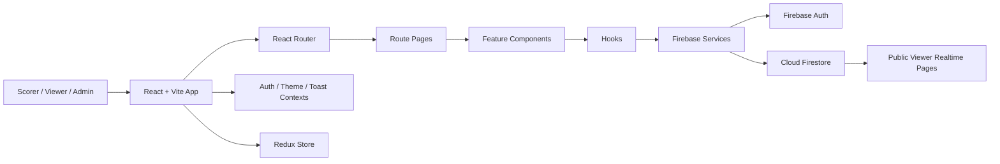
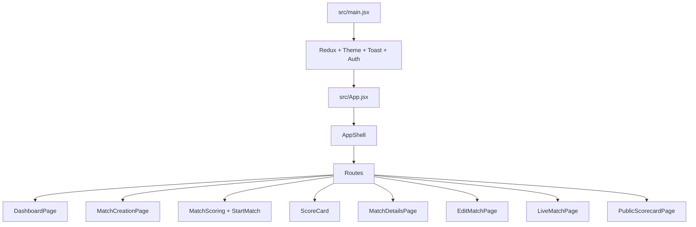
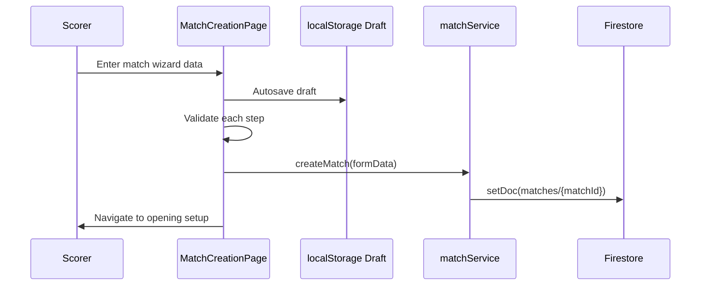
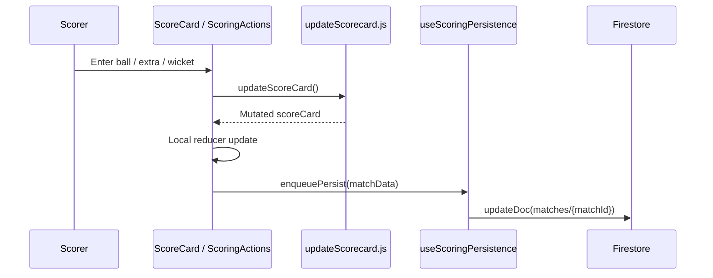
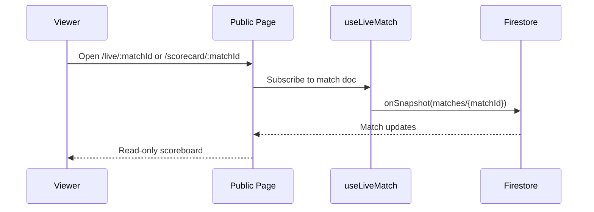

# CricVelo Architecture

## System Architecture



CricVelo is a single-page app hosted on Firebase Hosting. It uses Firebase Auth for identity and Firestore for all application data. The app has no server-side business layer; security and persistence boundaries are implemented in Firestore rules and client services.

## Component Hierarchy



Shared UI components live in `src/components/ui` and should be preferred for buttons, dialogs, inputs, page wrappers, statuses, loading, empty, and error states.

## Data Flow

### Match Creation



### Active Scoring



Active scoring intentionally avoids `onSnapshot` as the source of truth. The local reducer is authoritative during scoring, and Firestore writes are queued.

### Public Viewing



## Firestore Structure

- `matches/{matchId}` stores match metadata, team snapshots, toss, rules, scorecard, public visibility, and lifecycle fields.
- `users/{uid}` stores role and profile fields.
- `teams/{teamId}` and `players/{playerId}` are allowed by rules/services but are not yet central to the product.

## Authentication Architecture

```mermaid
flowchart TD
  FirebaseAuth[Firebase Auth] --> AuthContext[AuthContext]
  AuthContext --> UserProfile[users/{uid}]
  UserProfile --> Role[viewer / scorer / admin]
  Role --> ProtectedRoute[ProtectedRoute]
  Role --> ScorerRoute[ScorerRoute]
  ProtectedRoute --> Dashboard
  ScorerRoute --> CreateScoreEdit[Create / Score / Edit]
```

- `ProtectedRoute` requires authenticated and email-verified users.
- `ScorerRoute` wraps `ProtectedRoute` and requires `scorer` or `admin`.
- `ensureUserProfile` creates missing profiles with default role `viewer`.
- Firestore rules independently enforce scorer/admin write access.

## State Management

- React Context:
  - `AuthContext`: session, profile, role, logout, loading.
  - `ThemeModeContext`: light/dark mode and toggle.
  - `ToastContext`: global feedback.
- Redux:
  - `matchSlice` and `userSlice` exist, but most app behavior currently uses local state/hooks.
- Local state:
  - Match creation wizard state and draft recovery.
  - Active scoring reducer state.
  - Undo/redo stacks.
  - Current over and extras toggles.
- Firestore realtime hooks:
  - `useFirestoreDocument`
  - `useRealtimeCollection`
  - `useLiveMatch`
  - `useDashboardMatches`

## Scoring Architecture

Scoring is split across UI, mutation logic, and persistence:

- `StartMatch.jsx`: initializes innings.
- `ScoreCard.jsx`: reducer, flow control, innings end, completion, bowler selection, timeline, undo/redo.
- `ScoringActions.jsx`: delivery input, extras, wicket dialog, current-over summaries.
- `Selectbatsman.jsx`: replacement batter selection after wicket.
- `SelectBowler.jsx`: bowler change at over end.
- `EndOfInnings.jsx`: first-innings summary and second-innings handoff.
- `updateScorecard.js`: scoring mutations.
- `matchDisplay.js`: result derivation and completion fields.

## Persistence Architecture

- Match creation uses `setDoc`.
- Match updates use `updateDoc`.
- Active scoring queues writes through `useScoringPersistence`.
- Failed scoring writes are serialized into `localStorage` under a match-specific key and retried.
- Match creation drafts are stored in `localStorage`.
- Timeline arrays are normalized before Firestore persistence to avoid unsafe array/object shapes.

## Architectural Risks

- Client-side business logic is large and hard to verify without automated tests.
- Active scoring uses mutable nested objects in helpers, increasing regression risk.
- No ownership model: any scorer/admin can modify any match allowed by rules.
- Firestore rules guard broad collection access but do not deeply validate match schemas.
- Dashboard fetches a limited global match set and partitions client-side; this avoids indexes but may not scale.
- Public/private visibility is enforced in both UI and rules, but data modeling for private sharing is limited.
