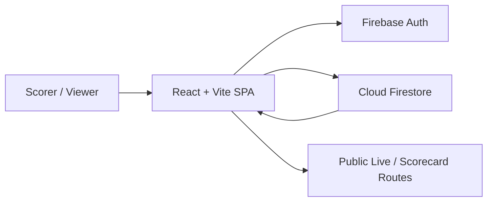
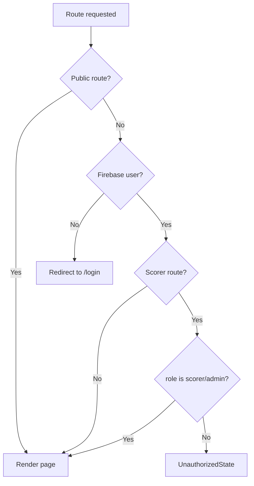
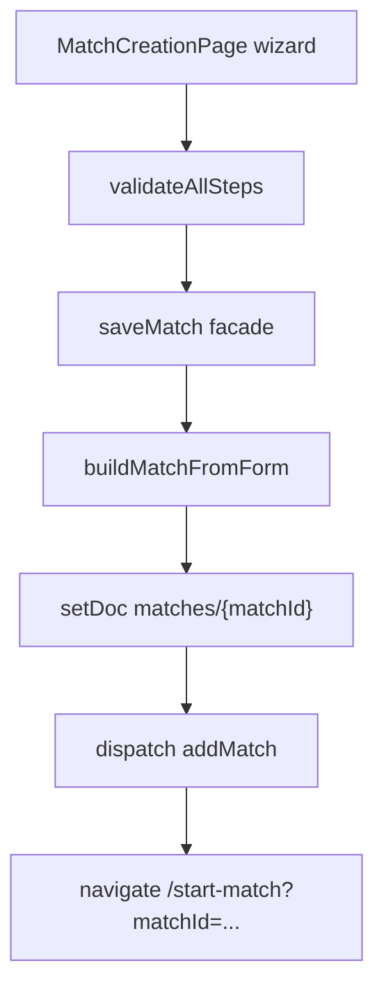
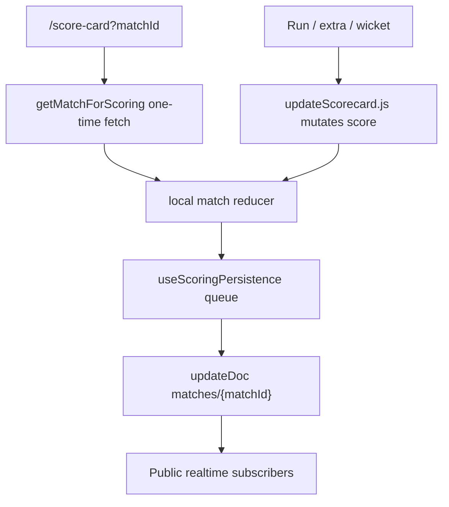

# CricVelo Architecture Report

## System Type

CricVelo is currently a client-heavy single-page application. There is no custom backend server in the repository. Firebase Authentication and Cloud Firestore provide authentication, authorization data, persistence, and realtime updates.



## Frontend Architecture

### Framework

- React 18
- Vite 6
- JavaScript modules
- Material UI v6

### Routing

Routes are defined in `src/App.jsx`.

| Route | Access | Component |
|---|---|---|
| `/login` | Public | `LoginPage` |
| `/register` | Public | `RegisterPage` |
| `/` | Authenticated | `DashboardPage` |
| `/dashboard` | Authenticated | `DashboardPage` |
| `/create-match` | Scorer/admin | `MatchCreationPage` |
| `/matches/:matchId` | Scorer/admin | `MatchDetailsPage` |
| `/matches/:matchId/edit` | Scorer/admin | `EditMatchPage` |
| `/start-match?matchId=` | Scorer/admin | `MatchScoring` |
| `/start-second-innings?matchId=` | Scorer/admin | `MatchScoring` |
| `/score-card?matchId=` | Scorer/admin | `ScoreCard` |
| `/live/:matchId` | Public | `LiveMatchPage` |
| `/scorecard/:matchId` | Public | `PublicScorecardPage` |

### Route Protection



`ProtectedRoute` checks session. `ScorerRoute` wraps `ProtectedRoute` and checks `isScorer`.

### State Management

| State Area | Mechanism | Source of Truth |
|---|---|---|
| Auth session | `AuthContext` | Firebase Auth |
| User role/profile | `AuthContext` | `users/{uid}` Firestore doc |
| Toasts | `ToastContext` | React state |
| Theme mode | `ThemeModeContext` | React state |
| Dashboard matches | Firebase hook | Firestore realtime query |
| Match creation form | local React state | local wizard state, autosaved to localStorage |
| Active scoring | local reducer and local state | scorer UI state, persisted to Firestore queue |
| Match list Redux | Redux slice | mostly auxiliary, not primary |

### Component Structure

The UI follows route pages plus feature folders:

- Pages own routing and high-level data loading.
- Feature components own specific workflows.
- Shared UI components wrap MUI with app styling.
- Firebase hooks isolate realtime subscriptions.
- Service modules isolate Firestore SDK calls.

## Backend Architecture

There is no Express, Node API, controller layer, or server-side function layer in the repo.

The effective backend is:

- Firebase Authentication for identity
- Firestore documents for data
- Firestore security rules for access control

### Service Layer

| Service | Responsibility |
|---|---|
| `authService.js` | Firebase Auth wrappers for login/register/Google/logout/email verification |
| `userService.js` | User profile create, ensure, subscribe, role resolution |
| `matchService.js` | Match creation, read, update, patch, archive, visibility |
| `scoringService.js` | Scoring persistence facade |
| `dashboardService.js` | Dashboard query and client-side buckets |
| `teamService.js` | Placeholder, teams embedded in matches |
| `playerService.js` | Placeholder, players embedded in matches |
| `firestoreHelpers.js` | Snapshot normalization, reads, subscriptions, error handling |

### Data Flow: Match Creation



### Data Flow: Active Scoring



### Realtime Strategy

- Dashboard uses one query listener against `matches`.
- Match details, edit, setup, public live, and public scorecard use a document listener.
- Active scorer page intentionally avoids a live listener during ball entry and writes local changes through a queue.

This design reduces accidental remote overwrites while scoring, but it also means conflict behavior across multiple scorer tabs is not fully solved.

## Database Architecture

### Collections

| Collection | Current Status | Purpose |
|---|---|---|
| `matches` | Active | Match details, teams, toss, scoring rules, scorecard, lifecycle |
| `users` | Active | Auth profile and role |
| `teams` | Placeholder | Future first-class teams |
| `players` | Placeholder | Future first-class players |

### Match Document Shape

```js
{
  matchId,
  matchDetails: {
    teamA,
    teamB,
    location,
    date,
    title,
    matchType
  },
  teams: {
    teamA: { name, players, captain, wicketkeeper },
    teamB: { name, players, captain, wicketkeeper }
  },
  tossDetails: { winner, decision },
  scoringRules: {
    maxOvers,
    extras: { wides, noBalls }
  },
  scoreCard: {
    currentInning,
    innings: [
      {
        team,
        runs,
        wickets,
        overs,
        balls,
        batsmen,
        bowlers,
        extras
      }
    ],
    recentBallsByInnings,
    overHistoryByInnings
  },
  notes,
  status,
  isPublic,
  lifecyclePhase,
  archivedAt,
  deletedAt,
  createdAt,
  updatedAt
}
```

### User Document Shape

```js
{
  uid,
  email,
  displayName,
  role, // admin | scorer | viewer
  createdAt,
  updatedAt
}
```

### Relationships

- Auth user uid maps to `users/{uid}`.
- Teams and players are embedded in `matches`; no global team/player identity exists yet.
- Scorecard innings are embedded in the match document.
- Public views read the same match document as scorer views.

### Indexes

`firestore.indexes.json` currently defines no composite indexes. Dashboard avoids composite index needs by reading up to 50 matches and partitioning client-side.

## Security Rules Summary

Rules allow:

- Users to read/create/update their own profile, with role preserved on update.
- Anyone to read public matches.
- Signed-in users to read matches.
- Scorers/admins to create/delete matches.
- Scorers/admins to update matches, with restrictions by status.
- Signed-in users to read teams/players.
- Scorers/admins to write teams/players.

Risks:

- `isPublicMatch()` uses `resource.data`, which can be problematic when the document does not exist.
- All signed-in users can read all matches, including private matches.
- No ownership model exists for matches.
- Role promotion is manual in Firestore.

## Build and Validation

Validated on 2026-05-29:

- Production build: passes using bundled Node and `vite build`.
- Build warning: main bundle is large at about 909 kB minified.
- ESLint: fails with 583 problems. Most are prop-types and unused imports, but real defects include missing hook imports, undefined `updateOvers`, and missing `Box` import in a viewer component.

## Architecture Strengths

- Clear Firebase service layer.
- Good separation of public routes and scorer routes.
- Realtime read hooks are reusable.
- Match creation validation is centralized.
- Scoring persistence queue shows awareness of offline and write ordering issues.
- Existing docs are unusually strong for a young app.

## Architecture Risks

- No server-side domain layer for sensitive scoring changes.
- Firestore match document is doing too much.
- Scoring logic mutates nested objects directly.
- Match lifecycle never fully completes in the active scoring flow.
- Teams, players, tournaments, auctions, and admin remain mostly future scope.
- Test automation is absent.

