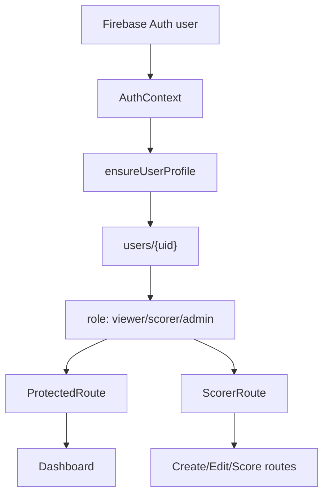

# Authentication Review

## Scope

This review covers Authentication only for Phase 1 MVP Stabilization:

- Login
- Registration
- Google Sign-In
- Route Protection
- Session Persistence
- Logout
- Email Verification

No implementation changes were made.

## Current Flow

### Login

Current behavior:

1. User opens `/login`.
2. User enters email and password.
3. `LoginPage` calls `loginWithEmail(email, password)`.
4. `authService` calls Firebase `signInWithEmailAndPassword`.
5. If Firebase returns a user and `user.emailVerified` is true, the app shows a success toast and navigates to `location.state.from` or `/dashboard`.
6. If the email is not verified, the app sends a verification email and shows an error message.
7. If Firebase throws, the UI shows a generic invalid email/password message.

Code involved:

- `src/pages/LoginPage.jsx`
- `src/services/firebase/authService.js`
- `src/context/AuthContext.jsx`
- `src/context/ToastContext.jsx`
- `src/pages/ProtectedRoute.jsx`

Notes:

- Login uses Firebase Auth correctly at the basic level.
- Redirect preservation exists through `location.state.from`.
- The login form does not validate empty fields before Firebase call.

### Registration

Current behavior:

1. User opens `/register`.
2. User enters email, password, and confirm password.
3. `RegisterPage` checks only password equality.
4. It calls `registerWithEmail(email, password)`.
5. Firebase creates the Auth user.
6. The app creates a Firestore profile with `role: viewer`.
7. The app sends an email verification link.
8. The app shows success copy telling the user to verify email and sign in as a viewer.

Code involved:

- `src/pages/RegisterPage.jsx`
- `src/services/firebase/authService.js`
- `src/services/firebase/userService.js`
- `src/services/firebase/constants.js`
- `firestore.rules`

Notes:

- Normal email registration creates viewer accounts.
- Registration does not redirect after success.
- Registration leaves the Firebase user signed in unless Firebase behavior or later auth state handling signs them out; the UI copy tells them to sign in later, but the app may already have an authenticated session.

### Google Sign-In

Current behavior:

1. User clicks `Sign in with Google`.
2. `GoogleLoginButton` calls `loginWithGoogle()`.
3. `authService` calls Firebase `signInWithPopup` using `GoogleAuthProvider`.
4. On success, the button immediately shows a success toast and navigates to the requested redirect.
5. `AuthContext` observes Firebase auth state and ensures a Firestore profile exists.
6. Because `AuthContext` calls `ensureUserProfile(user, USER_ROLES.SCORER)`, a new Google user without a profile becomes a scorer.

Code involved:

- `src/components/GoogleLoginButton.jsx`
- `src/services/firebase/authService.js`
- `src/context/AuthContext.jsx`
- `src/services/firebase/userService.js`

Notes:

- Google sign-in bypasses email verification checks.
- New Google users receive scorer access through the legacy fallback path.

### Route Protection

Current behavior:

1. Route table in `App.jsx` marks public, authenticated, and scorer-only routes.
2. `ProtectedRoute` checks `authLoading`.
3. While auth initializes, it renders `AuthLoadingScreen`.
4. If unauthenticated, it redirects to `/login` and preserves the attempted path in router state.
5. If authenticated, it renders children.
6. `ScorerRoute` wraps `ProtectedRoute`, then checks `isScorer`.
7. While profile loading is active, `ScorerRoute` renders a permission loading state.
8. If the role is not scorer/admin, it renders `UnauthorizedState`.

Code involved:

- `src/App.jsx`
- `src/pages/ProtectedRoute.jsx`
- `src/pages/ScorerRoute.jsx`
- `src/components/auth/AuthLoadingScreen.jsx`
- `src/components/auth/UnauthorizedState.jsx`
- `src/context/AuthContext.jsx`
- `src/utils/roles.js`

Protected routes:

- `/`
- `/dashboard`

Scorer/admin routes:

- `/matches/:matchId`
- `/matches/:matchId/edit`
- `/create-match`
- `/start-match`
- `/score-card`
- `/start-second-innings`

Public routes:

- `/login`
- `/register`
- `/live/:matchId`
- `/scorecard/:matchId`

### Session Persistence

Current behavior:

1. Firebase Auth default browser persistence is used.
2. `AuthContext` subscribes to `onAuthStateChanged`.
3. When a user is restored, `AuthContext` sets `user`, then ensures/subscribes to the Firestore user profile.
4. `ProtectedRoute` waits for `authLoading`, but not for profile loading.
5. `ScorerRoute` waits for both auth and profile loading.

Code involved:

- `src/context/AuthContext.jsx`
- `src/services/firebase/authService.js`
- `src/services/firebase/userService.js`
- `src/pages/ProtectedRoute.jsx`
- `src/pages/ScorerRoute.jsx`

Notes:

- There is no custom persistence mode for the "Remember device" checkbox.
- Role restoration depends on Firestore profile read success.

### Logout

Current behavior:

1. User opens the profile menu in `AppShell`.
2. User clicks `Sign Out`.
3. `AppShell` calls `logout()` from `AuthContext`.
4. `AuthContext.logout` calls Firebase `signOut`, then clears local `user` and `profile`.
5. `AppShell` navigates to `/login`.

Code involved:

- `src/layout/AppShell.jsx`
- `src/context/AuthContext.jsx`
- `src/services/firebase/authService.js`

Notes:

- Logout clears local auth context after Firebase sign-out.
- Logout errors are not handled in UI.

### Email Verification

Current behavior:

- Registration sends verification email after creating the user profile.
- Login checks `user.emailVerified`.
- If not verified, login sends another verification email and shows a message.
- Verified users may navigate to dashboard.

Code involved:

- `src/pages/LoginPage.jsx`
- `src/pages/RegisterPage.jsx`
- `src/services/firebase/authService.js`

Important concern:

- `ProtectedRoute` only checks `isAuthenticated`, not `emailVerified`.
- If an unverified user is signed in through registration/session restoration, protected routes may be accessible despite the login page enforcing verification.

## Code Architecture

### Core Auth Modules

| File | Responsibility |
|---|---|
| `src/services/firebase/authService.js` | Thin Firebase Auth wrapper for login, registration, Google sign-in, logout, email verification, auth listener |
| `src/services/firebase/userService.js` | Firestore user profile creation, profile lookup, role resolution, profile subscription |
| `src/context/AuthContext.jsx` | App-wide auth session, profile, role, permission booleans, logout |
| `src/pages/LoginPage.jsx` | Email login UI, email verification handling, Google button host |
| `src/pages/RegisterPage.jsx` | Viewer registration UI and profile creation |
| `src/components/GoogleLoginButton.jsx` | Google sign-in action |
| `src/pages/ProtectedRoute.jsx` | Authenticated route guard |
| `src/pages/ScorerRoute.jsx` | Scorer/admin route guard |
| `src/components/auth/AuthLoadingScreen.jsx` | Loading state |
| `src/components/auth/UnauthorizedState.jsx` | Permission denial state |
| `firestore.rules` | Server-side Firestore role enforcement |

### Auth Data Model

Firestore profile:

```js
{
  uid,
  email,
  displayName,
  role, // admin | scorer | viewer
  createdAt,
  updatedAt
}
```

Effective role logic:

- If a profile has `role`, use it.
- If no profile or no role exists, treat the user as `scorer`.
- New email registrations explicitly create `role: viewer`.
- New Google sign-ins currently follow the no-profile scorer path.

### Auth Architecture Diagram



## Bugs Found

### P0/P1 Security and Access Bugs

1. New Google users can become scorers automatically.

Evidence:

- `AuthContext` calls `ensureUserProfile(user, USER_ROLES.SCORER)`.
- `userService.resolveRole` defaults missing roles to scorer.
- Firestore rules also default missing profiles to scorer.

Impact:

- A user who signs in with Google and has no profile may gain match creation and scoring access.
- This conflicts with normal registration, which creates viewer users.

2. Email verification is enforced only during manual email login, not at route guard level.

Evidence:

- `LoginPage` checks `user.emailVerified`.
- `ProtectedRoute` only checks `isAuthenticated`.

Impact:

- Newly registered unverified users may still have an authenticated Firebase session and access protected viewer routes.
- If they are treated as scorer through fallback, the impact is higher.

3. Signed-in users can read all matches in Firestore rules.

Evidence:

- `firestore.rules` allows match read if `isPublicMatch() || isSignedIn()`.

Impact:

- Private matches are hidden from public unauthenticated access, but not from any authenticated account.
- This is more authorization than viewer users should have for a privacy-aware MVP.

### Functional Bugs

4. "Forgot password?" links to `/register`.

Evidence:

- `LoginPage` renders the forgot password link with `to="/register"`.

Impact:

- Users cannot recover accounts from the login page.

5. "Remember device" is a UI-only checkbox.

Evidence:

- `rememberMe` state is set and toggled, but not used with Firebase persistence APIs.

Impact:

- The UI implies a persistence choice that the app does not honor.

6. Registration success messaging conflicts with actual Firebase session state.

Evidence:

- Firebase `createUserWithEmailAndPassword` signs in the created user.
- The app shows "then sign in as a viewer" but does not sign the user out or redirect.

Impact:

- User may be signed in while being told to sign in later.
- Protected route access depends on route guard behavior, not the registration success copy.

7. Login error handling is too generic.

Evidence:

- Login catch always shows "Invalid email or password."

Impact:

- Network errors, disabled accounts, too many requests, invalid email format, and Firebase configuration issues are indistinguishable.

8. Logout errors are not handled.

Evidence:

- `AppShell.handleLogout` awaits logout and navigates, with no try/catch.

Impact:

- If Firebase sign-out fails, UI may not explain what happened.

### Static Quality Bugs

9. Auth-related files contribute lint failures.

Examples:

- Unused `React` imports under modern JSX transform.
- Missing prop validation.
- Unused error variables in `LoginPage`, `GoogleLoginButton`.
- Fast-refresh warnings in context files.

Impact:

- Lint noise makes real authentication defects harder to spot.

## Edge Cases

### Login

- Empty email submits to Firebase instead of local validation.
- Empty password submits to Firebase.
- Invalid email format is reported as generic invalid credentials.
- Too many failed attempts are reported as generic invalid credentials.
- Disabled user accounts are reported as generic invalid credentials.
- Email verification send can fail after successful password authentication.
- Verification email can be resent repeatedly without cooldown.
- User may attempt login while a previous login request is still pending.

### Registration

- Empty email/password fields rely on Firebase errors.
- Weak password relies on Firebase errors.
- Existing email shows raw Firebase error message.
- Profile creation can fail after Auth user creation succeeds.
- Verification email sending can fail after Auth user and profile creation succeed.
- User can click Create Account multiple times while request is in progress.
- Success and error messages are not cleared consistently before each attempt.

### Google Sign-In

- Popup blocked by browser.
- User closes popup.
- New Google account has no profile and becomes scorer.
- Existing Google account with viewer profile should remain viewer.
- Google provider email verification is implicitly trusted by Firebase but not documented in UI.
- Multiple clicks can open repeated sign-in attempts.

### Route Protection

- Direct scorer route load depends on profile read timing.
- If profile read fails, `resolveRole(null)` can still produce scorer behavior through the default role path.
- Redirect state stores only `location.pathname`, not query string. Routes such as `/score-card?matchId=...` can lose `matchId` after login.
- Unknown routes redirect to `/dashboard`, which then requires auth.

### Session Persistence

- "Remember device" does not alter persistence.
- Firebase default persistence may keep users signed in even if checkbox is off.
- Profile subscription failure leaves ambiguous role state.
- Offline profile restore behavior is not defined.

### Logout

- Firebase sign-out failure has no user-facing feedback.
- Open scoring or pending local state is not considered by auth logout.
- Public pages still show authenticated user controls if user remains signed in.

### Email Verification

- Unverified account can potentially access protected routes through current session.
- Verification link returns to `/dashboard`, but there is no explicit action-code handling page.
- User may need to refresh auth token after verifying email in another tab.

## UX Issues

1. Forgot password link is misleading.
2. Remember device is misleading.
3. Registration says "viewer account" while login says "manager account"; role language is inconsistent.
4. Google sign-in does not explain what role the user will receive.
5. Error messages are either too generic in login or too raw in registration.
6. Buttons do not show loading/disabled states during auth requests.
7. No success action after registration, such as "Go to sign in" or "Resend email".
8. Verification flow does not tell users to refresh after verifying.
9. Profile menu shows generic "User Account" and avatar `U`, not user identity.
10. Unauthorized screen sends users to dashboard but does not explain how to request scorer access.

## Security Improvements

1. Change default new/missing profile behavior for MVP from scorer to viewer, or gate legacy scorer fallback behind a controlled migration flag.
2. Require verified email in route guards for email/password accounts, not only on login submit.
3. Decide whether Google users are trusted as verified, then document and enforce that policy.
4. Tighten Firestore match reads so private matches are not readable by every signed-in user.
5. Add match ownership or scorer assignment before enforcing fine-grained write rules.
6. Add admin-only role management instead of manual Firestore edits.
7. Prevent client-side role elevation in both UI and rules; current rule preserves role on user self-update, which is good.
8. Add rate/cooldown behavior for verification email resend in UI.
9. Use Firebase Auth error codes to provide safe, non-enumerating but actionable messages.
10. Preserve query strings during auth redirects to avoid users losing intended scorer context.

## Priority Ranking

### P0 - Must Fix Before MVP Auth Approval

1. New Google/no-profile users can become scorers automatically.
2. Email verification is not enforced by route guards.
3. Private matches are readable by every signed-in user.
4. Redirect after login drops query strings for query-based protected routes.

### P1 - Should Fix During Auth Stabilization

5. Forgot password link is incorrect.
6. Remember device checkbox is nonfunctional.
7. Registration can leave an unverified user signed in while copy says to sign in later.
8. Auth buttons lack loading and duplicate-submit protection.
9. Profile creation failure after Auth creation is not recovered cleanly.

### P2 - Polish and Maintainability

10. Improve error messages using Firebase error codes.
11. Add user identity display in the profile menu.
12. Add verification resend UX and cooldown.
13. Reduce auth lint noise.
14. Add auth flow tests.

## Recommended Fixes

### Recommended MVP-Safe Fix Set

1. Change default profile creation for new auth users to viewer, then explicitly promote scorer/admin through controlled admin/manual process.
2. Add a compatibility-only migration path for known legacy users instead of defaulting all missing profiles to scorer.
3. Update `ProtectedRoute` or `AuthContext` to expose and enforce `emailVerified` for email/password users.
4. Preserve `pathname + search` in protected-route redirects.
5. Replace the forgot password link with a real password reset flow or remove the link until implemented.
6. Remove "Remember device" or wire it to Firebase persistence choices.
7. Add loading state to login, register, and Google sign-in buttons.
8. After registration, either sign the user out or redirect to a verification-pending state.
9. Tighten Firestore read rules for private matches after defining match ownership/authorized viewers.
10. Add auth QA tests for the checklist items in `QA_CHECKLIST.md`.

### Suggested Auth Test Cases

- Valid verified email login redirects to dashboard.
- Invalid login shows safe error.
- Empty fields are blocked locally.
- Unverified email cannot access protected routes.
- Registration creates viewer role.
- Google sign-in new user does not become scorer unless explicitly approved.
- Viewer cannot access `/create-match`.
- Scorer can access `/create-match`.
- Logout redirects to `/login`.
- Auth redirect preserves query string, such as `/score-card?matchId=abc`.

## Approval Gate

Authentication should not move to implementation until the team approves the desired policy for these questions:

1. Should any missing-profile user still default to scorer for legacy support?
2. Should Google sign-in create viewer accounts by default?
3. Should unverified email users be blocked from all authenticated routes or only scorer routes?
4. What is the MVP rule for private match visibility among signed-in viewers?

