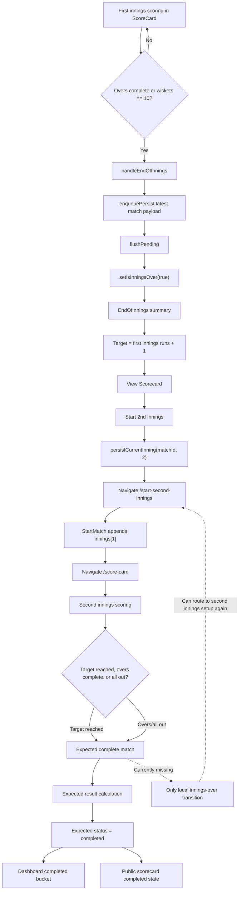

# INNINGS_AND_MATCH_COMPLETION_REVIEW.md

## Review Scope

This review covers only Innings Management and Match Completion. No application code was modified.

Primary files reviewed:

- `src/components/match/EndOfInnings.jsx`
- `src/components/match/ScoreCard.jsx`
- `src/components/match/StartMatch.jsx`
- `src/pages/MatchScoring.jsx`
- `src/services/firebase/scoringService.js`
- `src/services/firebase/matchService.js`
- `src/services/firebase/dashboardService.js`
- `src/hooks/firebase/useDashboardMatches.js`
- `src/pages/DashboardPage.jsx`
- `src/pages/PublicScorecardPage.jsx`
- `src/components/viewer/PublicMatchScorecard.jsx`
- `src/components/viewer/LiveScoreboard.jsx`
- `src/components/match/MatchScoreCard.jsx`
- `src/utils/matchDisplay.js`

## Architecture Overview

Innings and match lifecycle are currently handled mostly in the scoring UI rather than in a dedicated lifecycle service.

The first innings is initialized from `StartMatch.jsx`. Live scoring happens in `ScoreCard.jsx`. When overs or wickets reach the current stopping condition, `ScoreCard.jsx` calls `handleEndOfInnings()`, flushes pending score writes, and switches local UI into the `EndOfInnings.jsx` transition state.

`EndOfInnings.jsx` displays a first-innings summary, target, and scorecard. Starting the second innings calls `persistCurrentInning(matchId, 2)` and navigates to `/start-second-innings?matchId=...`. The same `MatchScoring.jsx` and `StartMatch.jsx` setup screen then appends a second innings object.

Result calculation exists only as presentation helpers in `src/utils/matchDisplay.js`. Dashboard and public viewer components can display completed match outcomes, but the reviewed scoring lifecycle does not appear to persist `status: "completed"`, `resultSummary`, `winner`, `completedAt`, or a durable result object.

### Responsibility Map

| Area | Files | Responsibility |
|---|---|---|
| First innings initialization | `StartMatch.jsx`, `MatchScoring.jsx`, `matchService.js` | Create first innings, set status to `in-progress`, persist full match |
| End innings trigger | `ScoreCard.jsx` | Detect max overs or wickets, flush score persistence, show transition UI |
| First-to-second innings transition | `EndOfInnings.jsx`, `scoringService.js`, `matchService.js` | Persist `scoreCard.currentInning = 2`, route to second innings setup |
| Second innings initialization | `StartMatch.jsx` | Infer batting side from first innings, append second innings |
| Target display | `ScoreCard.jsx`, `EndOfInnings.jsx`, `LiveScoreboard.jsx` | Display target and required runs |
| Result display | `matchDisplay.js`, `LiveScoreboard.jsx`, `MatchScoreCard.jsx`, `CompletedMatchesCard.jsx` | Derive winner/tie/margin for UI only |
| Dashboard propagation | `dashboardService.js`, `useDashboardMatches.js` | Bucket matches by persisted `status` |
| Public scorecard | `PublicScorecardPage.jsx`, `PublicMatchScorecard.jsx`, `LiveScoreboard.jsx` | Realtime read-only display based on persisted match document |

## Workflow Diagram

## Current Lifecycle Trace

### First Innings

1. `MatchScoring.jsx` loads a match by `matchId` through `useLiveMatch()`.
2. `StartMatch.jsx` calculates the first batting team from toss winner and toss decision.
3. The scorer selects striker, non-striker, and opening bowler.
4. `StartMatch.jsx` creates `scoreCard.currentInning = 1`, initializes `scoreCard.innings = [inningObj]`, sets `status: "in-progress"`, and calls `updateMatchById()`.
5. User is routed to `/score-card?matchId=...`.

### End First Innings

`ScoreCard.jsx` ends an innings when:

- current innings overs are greater than or equal to `matchData.scoringRules.maxOvers`, or
- current innings wickets equal `10`, or
- scorer manually confirms the End Innings dialog.

The end action:

1. Enqueues the latest match payload.
2. Calls `flushPending()`.
3. Sets local `isInningsOver` to `true`.
4. Displays `EndOfInnings.jsx`.

No persisted innings-ended phase is written, other than scorecard aggregate data.

### Target Calculation

Target is calculated in several UI locations as:

- first innings runs + 1

Examples:

- `EndOfInnings.jsx`: `Target: currentInning.runs + 1`
- `ScoreCard.jsx`: required target text uses first innings runs and adds one internally.
- `LiveScoreboard.jsx`: `Target: innings[0].runs + 1`

The basic target formula is correct for standard limited-overs cricket without DLS or revised targets.

### Second Innings Setup

1. `EndOfInnings.jsx` calls `persistCurrentInning(matchId, 2)`.
2. This only updates `"scoreCard.currentInning": 2`.
3. User is routed to `/start-second-innings?matchId=...`.
4. `MatchScoring.jsx` loads the updated match.
5. `StartMatch.jsx` sees an existing `scoreCard.currentInning`, infers the second batting team as the opposite of `innings[0].team`, and appends a new innings object.
6. The match is saved through `updateMatchById()` and routed back to `/score-card`.

### Second Innings Scoring

The same `ScoreCard.jsx` scoring flow is used for second innings.

Current second-innings display includes:

- target text
- required run rate
- full scorecard inspection button
- normal scoring controls

However, scoring lifecycle does not visibly complete the match when:

- the chasing team reaches or passes target,
- the chasing team is all out,
- the second innings reaches maximum overs,
- scores are tied after the second innings.

### Match Result and Completion

`src/utils/matchDisplay.js` can derive an outcome from two innings:

- second innings runs greater than first innings runs: chasing team wins by wickets
- second innings runs less than first innings runs: defending team wins by runs
- scores equal: match tied

These helpers are presentation-only. The scoring lifecycle does not persist:

- `status: "completed"`
- `resultSummary`
- `winner`
- `winnerTeamKey`
- `margin`
- `isTie`
- `completedAt`
- `lifecyclePhase: "completed"`

### Dashboard Propagation

Dashboard cards are driven by persisted match `status`:

- `scheduled`
- `in-progress`
- `completed`

Since match completion is not persisted by the scoring lifecycle, completed matches will remain in the ongoing bucket.

### Public Scorecard

Public scorecard and live scoreboard subscribe to the match document through `useLiveMatch()`. They can render completed UI only when `match.status === "completed"`.

Because scoring does not persist completed status, public viewers are likely to keep seeing the match as live/in-progress even after the practical end of the match.

## Match Lifecycle Validation Matrix

| Lifecycle Item | Expected Behavior | Current Behavior | Status |
|---|---|---|---|
| First innings creation | Create innings[0], set currentInning 1, status in-progress | Implemented in `StartMatch.jsx` | Mostly OK |
| First batting team from toss | Toss winner + decision determines team | Implemented | Mostly OK |
| End innings by overs | Ends when max overs reached | Implemented in `ScoreCard.jsx` | Partial |
| End innings by all out | Ends when all wickets fall | Uses hardcoded `wickets === 10` | Bug for custom team sizes |
| Manual end innings | Scorer can end innings explicitly | Implemented with confirm dialog | Risky without validation |
| Flush pending writes before transition | Latest score should be saved before transition | `handleEndOfInnings()` flushes pending writes | Good |
| Persist innings-ended phase | Firestore should know innings 1 ended | Not persisted as a phase | Missing |
| Target calculation | Target = first innings runs + 1 | Displayed correctly | OK for standard rules |
| Second innings currentInning | Should switch to 2 with innings[1] initialized atomically | `currentInning` set to 2 before innings[1] exists | Data risk |
| Second innings setup | Opposite team bats | Implemented by inverting innings[0].team | Mostly OK |
| Duplicate opening batters | Should be prevented | Not prevented in `StartMatch.jsx` | Bug inherited from setup |
| Target reached | Match should complete immediately | Not implemented | Critical gap |
| Second innings overs complete | Match should complete and result calculated | Calls generic innings-over flow | Critical gap |
| Second innings all out | Match should complete and result calculated | Calls generic innings-over flow | Critical gap |
| Tie handling | Match should persist tie result | UI helper can derive tie, not persisted | Missing |
| Winner calculation | Winner and margin should persist | Only derived in UI helpers | Missing |
| Completed status | Match status should become completed | Not written by scoring lifecycle | Critical gap |
| Dashboard completed bucket | Completed match should move from ongoing to completed | Depends on status; will not move | Critical gap |
| Public completed state | Public page should show final result | Depends on status; likely not shown | Critical gap |

## Bugs Found

### P0 - Critical Lifecycle Bugs

1. Match completion is not persisted.
   - The scoring lifecycle does not set `status: "completed"` after the second innings ends or target is reached.
   - Impact: dashboard, public scorecard, and match lists cannot reliably show completed matches.

2. Target reached does not automatically complete the match.
   - `ScoreCard.jsx` displays required target text but does not stop scoring when the chasing side passes the target.
   - Impact: scorers can continue adding balls after the match should be over.

3. Second innings completion reuses first-innings transition UI.
   - `EndOfInnings.jsx` always labels the state as "End of 1st Innings" and offers "Start 2nd Innings".
   - Impact: after second innings ends, the app can present the wrong action and potentially route back into second-innings setup.

4. `scoreCard.currentInning` is persisted as `2` before `innings[1]` exists.
   - `persistCurrentInning()` only updates the current inning number.
   - Impact: Firestore can temporarily contain an invalid scorecard shape where `currentInning` points to a missing innings object.

5. Second-innings setup can append another innings if repeated.
   - `StartMatch.jsx` appends an innings whenever `scoreCard.currentInning` exists.
   - Impact: repeated navigation or second-innings end flow can create duplicate/third innings.

6. `MatchScoreCard.jsx` uses `Box` and `AppButton` without importing them.
   - Impact: opening the full match scorecard can crash at runtime.

7. `PublicMatchScorecard.jsx` uses `Box` without importing it.
   - Impact: public scorecard can crash when innings exist.

### P1 - High Priority Bugs

8. All-out condition is hardcoded to `10` wickets.
   - Match creation supports custom player counts, but innings completion assumes 11-player cricket.
   - Impact: short-team matches cannot complete correctly.

9. Result calculation is not stored with the match.
   - Helpers derive winner/tie/margin at render time only.
   - Impact: dashboard, exports, sharing, and audit views lack durable result data.

10. Manual End Innings can be used at any time without lifecycle-specific validation.
    - Impact: scorer can end an innings early without required confirmation context or reason.

11. There is no persisted innings phase.
    - Examples: `firstInningsComplete`, `secondInningsSetup`, `completed`.
    - Impact: refreshes during transition can strand the match in ambiguous state.

12. First-to-second innings handoff is split across multiple writes and routes.
    - Impact: network failure or refresh can leave the match partially transitioned.

13. Dashboard completed card is effectively unreachable from scoring.
    - Completed bucket only reads `status === "completed"`.
    - Impact: completed match UX does not work for normal scoring flow.

14. Public viewer completed result is effectively unreachable from scoring.
    - `LiveScoreboard.jsx` has completed display, but scoring never writes completed status.
    - Impact: public viewers may see stale live state after match end.

### P2 - Medium Priority Bugs and Gaps

15. Winner-by-wickets calculation assumes 10 possible wickets.
    - `getMatchOutcome()` and `getCompletedResultLine()` use `10 - wickets`.
    - Impact: incorrect result margins for non-11-player matches.

16. Result helpers do not account for abandoned/no-result/retired scenarios.
    - Impact: future lifecycle states will need deeper changes.

17. Target calculation does not support revised targets.
    - Impact: acceptable for MVP if DLS is out of scope, but should be explicit.

18. End-of-innings UI does not show save failure recovery strongly enough.
    - Impact: scorer may proceed without understanding transition persistence failed.

19. Second innings setup does not prevent duplicate striker/non-striker selections.
    - Impact: invalid innings can start.

20. `StartMatch.jsx` stores `battingTeam: matchData.teams.battingTeam?.name` and `bowlingTeam: matchData.teams.bowlingTeam?.name`, which are undefined for the current match shape.
    - Impact: innings metadata remains incomplete or misleading.

## Edge Cases

| Edge Case | Current Risk |
|---|---|
| Chasing team hits winning run before over ends | Match can continue scoring |
| Chasing team equals first innings score after max overs | Tie can be derived but not persisted |
| Chasing team all out below target | Match not marked completed |
| Chasing team all out at equal score | Tie not persisted |
| Second innings reaches max overs | Generic EndOfInnings UI appears instead of result |
| Manual end first innings early | No reason/status persisted |
| Manual end second innings early | App may offer "Start 2nd Innings" again |
| Refresh after `currentInning = 2` but before innings[1] append | Scorecard can point at missing innings |
| User revisits `/start-second-innings` after setup | Another innings can be appended |
| Short roster match | Hardcoded 10-wicket logic fails |
| Super over or multi-innings match | Data model does not distinguish supported/unsupported cases |
| Public scorecard with innings | Missing import can crash page |
| Full scorecard during scoring | Missing imports can crash page |
| Dashboard after match ends | Match remains ongoing |
| Multi-scorer ending innings | Full-document writes can race with active scorer updates |

## Data Integrity Risks

1. Match lifecycle state is not centralized. UI components decide major lifecycle transitions independently.
2. `scoreCard.currentInning = 2` can be saved before the second innings object exists.
3. Match result is not persisted, so every consumer must recalculate from mutable scorecard state.
4. Completed status is absent from the scoring transition, so dashboard and public views diverge from real match state.
5. Manual end innings does not store why or who ended the innings.
6. Wicket limits and result margins assume 11-player cricket.
7. Duplicate second innings creation is possible through repeated setup navigation.
8. Full-document updates can overwrite lifecycle fields if multiple clients are active.

## Firestore Risks

1. Lifecycle transitions are split across multiple writes:
   - save latest scorecard
   - update current inning
   - append second innings
   - expected but missing completion update

2. There is no transaction wrapping first-to-second innings transition.

3. There is no transaction or version check for final match completion.

4. There is no immutable match result/audit record.

5. Dashboard status propagation depends entirely on the `status` field, but scoring does not update it to completed.

6. A failed write during transition can leave the document in a partially updated state.

7. Public scorecard consumers subscribe to raw match state and therefore inherit any partial lifecycle state immediately.

## UX Findings

### Strengths

- End innings has a confirmation dialog in `ScoreCard.jsx`.
- Pending score writes are flushed before showing the innings transition.
- First innings target is clearly displayed.
- Second innings scoring displays required runs and required run rate.
- Dashboard and public viewer already have UI concepts for completed matches.

### Issues

1. Second innings end does not produce a clear final-result experience.
2. The same `EndOfInnings.jsx` copy and action are used for all innings, so it is wrong after innings two.
3. Scorer is not stopped when the chasing team wins.
4. Scorer is not guided through tie or defending-team-win outcomes.
5. Refresh during second innings setup can create confusing or blank states.
6. Dashboard says "No completed matches" even after a match has practically finished, because status remains in-progress.
7. Public scorecard can continue to present the match as live after completion.
8. Full scorecard and public scorecard have runtime import issues that can break result viewing.
9. Manual end innings does not communicate consequences differently for first innings vs second innings.
10. No final confirmation screen shows winner, margin, innings totals, and publish/share actions.

## Security Findings

1. There is no visible client-side role/status guard that prevents scoring after a match should be completed.
2. No lifecycle write appears to record the user who ended an innings or completed a match.
3. Full-document writes increase the blast radius of unauthorized or stale clients.
4. Public viewers can see partial transition states because lifecycle writes are not atomic.
5. No immutable audit trail exists for final result calculation.

## Recommended Fixes

### P0

1. Add a dedicated match-completion path in `ScoreCard.jsx` or a lifecycle service.
   - Trigger when second innings target is reached, second innings overs are complete, or second innings is all out.

2. Persist completion fields atomically:
   - `status: "completed"`
   - `lifecyclePhase: "completed"`
   - `completedAt`
   - `resultSummary`
   - `winnerTeamKey`
   - `winnerName`
   - `margin`
   - `isTie`

3. Make second innings target reached stop scoring immediately.

4. Split first-innings transition UI from match-completion UI.
   - `EndOfInnings.jsx` should not offer "Start 2nd Innings" after innings two.

5. Prevent duplicate second innings creation.
   - If `scoreCard.innings[1]` already exists, route to scoring instead of appending.

6. Fix runtime imports in scorecard completion views:
   - `MatchScoreCard.jsx`
   - `PublicMatchScorecard.jsx`

### P1

7. Make the first-to-second innings transition atomic or self-healing.
   - Avoid persisting `currentInning = 2` without `innings[1]` unless a clear `secondInningsSetup` phase exists.

8. Replace hardcoded 10-wicket checks with team-size-aware innings completion.

9. Persist a first-innings-complete lifecycle phase.

10. Add lifecycle guards to scoring routes:
    - scheduled -> setup only
    - in-progress -> scoring only
    - completed -> read-only scorecard/result only

11. Update dashboard and public viewers from durable result fields instead of deriving everything ad hoc.

12. Add transition failure handling and recovery prompts.

### P2

13. Add reason tracking for manual innings end.

14. Add tests for lifecycle transitions and dashboard propagation.

15. Add validation around second innings setup duplicate players and undefined innings metadata.

16. Make result helpers team-size-aware for wickets-in-hand margin.

17. Add explicit non-support messaging for DLS/revised target scenarios if out of MVP scope.

18. Add completed-match sharing and public scorecard link confirmation after result.

## Priority Ranking

| Priority | Item | Reason |
|---|---|---|
| P0 | Persist `status: completed` and result fields | Dashboard/public completion cannot work without this |
| P0 | Complete match when target is reached | Core cricket lifecycle rule |
| P0 | Complete match after second innings overs/all out | Core match lifecycle rule |
| P0 | Replace second-innings end UI | Current UI can send scorer back to setup |
| P0 | Prevent duplicate second innings append | Can corrupt scorecard with extra innings |
| P0 | Fix scorecard completion runtime imports | Result/public scorecard can crash |
| P1 | Atomic second innings transition | Prevents invalid `currentInning` state |
| P1 | Team-size-aware wicket limits | Required for created match formats |
| P1 | Persist lifecycle phases | Improves refresh/recovery |
| P1 | Add route/status guards | Prevents scoring wrong lifecycle state |
| P1 | Durable dashboard result data | Avoids inconsistent derived displays |
| P1 | Transition recovery UX | Needed for real match pressure |
| P2 | Manual end reason | Improves auditability |
| P2 | Lifecycle regression tests | Prevents high-risk regressions |
| P2 | Duplicate player validation in second setup | Protects innings initialization |
| P2 | Team-size-aware result margins | Correct custom match results |
| P2 | Revised target stance | Clarifies MVP scope |
| P2 | Result sharing UX | Useful after core completion works |

## MVP Readiness Assessment For Innings And Match Completion

The first-innings-to-second-innings path exists and can support a basic manual transition, but match completion is not MVP-stable.

The biggest issue is that the lifecycle stops at "innings over" and does not reliably become "match completed." Result helpers and completed UI exist, but the core scoring flow does not persist the final status or result. This blocks dashboard correctness, public scorecard correctness, and scorer workflow closure.

Recommended status: **Partially Working, Not MVP-Ready**

Suggested innings and match completion readiness score: **42 / 100**
