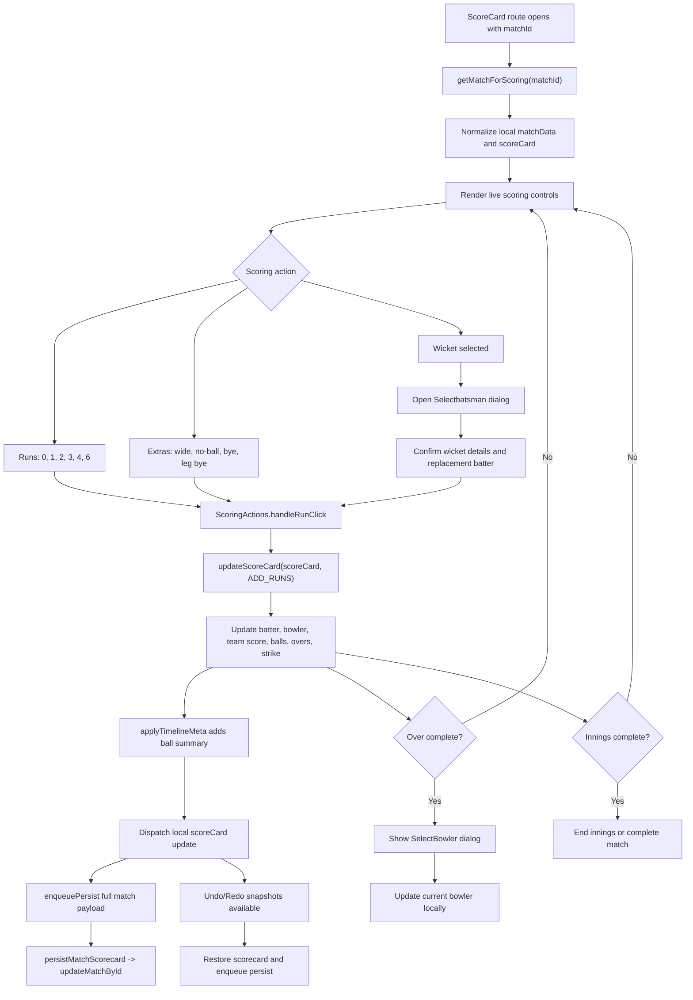

# LIVE_SCORING_REVIEW.md

## Review Scope

This review covers only the existing Live Scoring workflow. No code changes or fixes were implemented.

Primary files reviewed:

- `src/components/match/ScoreCard.jsx`
- `src/components/match/ScoringActions.jsx`
- `src/helpers/updateScorecard.js`
- `src/components/match/Selectbatsman.jsx`
- `src/components/match/SelectBowler.jsx`
- `src/components/match/BattingScoreCard.jsx`
- `src/components/match/BowlingScoreCard.jsx`
- `src/components/match/CurrentOver.jsx`
- `src/hooks/useScoringHistory.js`
- `src/hooks/useScoringPersistence.js`
- `src/services/firebase/scoringService.js`

## Architecture Overview

Live scoring is centered around `ScoreCard.jsx`, which loads a match by `matchId`, keeps a local editable `matchData` state object, renders scoring controls, and persists scorecard updates to Firestore through a queued persistence hook.

The flow is intentionally local-first during scoring. `ScoreCard.jsx` fetches the match once with `getMatchForScoring()`, then avoids a realtime listener while the scorer is active. Ball events mutate local scorecard state immediately, push undo history snapshots, and enqueue a full match payload save through `useScoringPersistence`.

Core responsibilities:

| Area | Files | Responsibility |
|---|---|---|
| Scoring screen orchestration | `ScoreCard.jsx` | Fetch match, derive teams/innings, dispatch reducer actions, persist scorecard, manage innings transitions, render scoring UI |
| Scoring input | `ScoringActions.jsx` | Run buttons, extras selection, wicket toggle, duplicate-click guard, ball summary generation |
| Score mutation helper | `updateScorecard.js` | Apply runs, extras, legal balls, strike changes, bowler stats, wicket helper paths |
| Wicket dialog | `Selectbatsman.jsx` | Select wicket type, fielder, out batter for run out, replacement batter, then commit wicket event |
| Bowler selection | `SelectBowler.jsx` | Select next bowler at over transition, prevent immediate same-bowler selection in UI |
| Undo/redo | `useScoringHistory.js` | Snapshot scorecard state before commits, restore previous/future scorecard versions |
| Persistence | `useScoringPersistence.js`, `scoringService.js` | Queue full match writes, retry failed writes, localStorage recovery, Firestore update call |
| Rendering | `BattingScoreCard.jsx`, `BowlingScoreCard.jsx`, `CurrentOver.jsx`, `BallTimeline` | Display live innings, batter/bowler tables, current over, ball history |

### Important Architectural Observation

The app currently treats the scorecard as a mutable nested object. `updateScorecard.js`, `Selectbatsman.jsx`, and `ScoreCard.jsx` mutate deep scorecard structures and then return or dispatch shallow copies. This works for many visible flows but increases the risk of history corruption, stale React renders, and accidental persistence of intermediate invalid states.

## Workflow Diagram

## Current Flow

### Loading Live Scoring

1. User reaches `/score-card?matchId=<id>`.
2. `ScoreCard.jsx` reads `matchId` from query params.
3. `getMatchForScoring(matchId)` fetches the match.
4. The component stores the match in local state.
5. `scoreCard.currentInning` determines the active innings.
6. `battingTeam` and `bowlingTeam` are derived from active innings IDs or fallback team references.
7. UI renders current totals, run controls, extras controls, wicket controls, current over, score tables, and timeline.

### Runs

Run buttons for `0`, `1`, `2`, `3`, `4`, and `6` are handled by `ScoringActions.jsx`.

The normal run path:

1. Push the previous scorecard into undo history.
2. Build a ball summary.
3. Call `updateScoreCard(scoreCard, "ADD_RUNS", { runs, extras, rules })`.
4. Update striker runs and balls.
5. Update team score.
6. Update bowler balls, overs, and conceded runs.
7. Rotate strike on odd runs.
8. Rotate strike at the end of a legal over.
9. Append ball metadata to current over/timeline state.
10. Dispatch the updated scorecard.
11. Enqueue a Firestore save.

### Extras

`ScoringActions.jsx` controls mutual exclusion for extra types:

- Wide disables no-ball, bye, and leg-bye.
- No-ball disables wide.
- Bye and leg-bye disable wide and each other.

`updateScorecard.js` applies extra logic in `handleExtras()`.

Observed behavior:

- Wides increase team runs, bowler conceded runs, and wide extras.
- No-balls increase team runs, bowler conceded runs, and no-ball extras.
- Byes and leg-byes increase team runs and extras but do not increase bowler conceded runs.
- Byes and leg-byes count as legal balls.
- Wides and no-balls do not advance legal ball count in the main helper path, but no-ball currently increments striker balls incorrectly.

### Wickets

When wicket is toggled in `ScoringActions.jsx`, the scoring action opens `Selectbatsman.jsx`.

Wicket confirmation currently:

1. Validates wicket type.
2. Requires a replacement batter.
3. For caught dismissals, requires a fielder.
4. For run out, allows selecting out batter and strike batter.
5. Applies run/extras first using `ADD_RUNS`.
6. Mutates wicket data and batter status directly.
7. Increments innings wicket count.
8. Credits bowler wicket for non-run-out dismissals.
9. Replaces striker or non-striker with selected next batter.
10. Dispatches updated scorecard and persists.

### Over Progression

Legal balls are tracked through innings `balls` and bowler `balls`.

`calculateOvers()` converts ball counts into decimal cricket-style overs, for example:

- `5` balls -> `0.5`
- `6` balls -> `1.0`
- `11` balls -> `1.5`
- `12` balls -> `2.0`

Over completion is mostly determined by legal ball count modulo six. However, the current over timeline uses delivery count rather than legal-ball count, which creates timeline risks when wides/no-balls occur.

### Bowler Rotation

At over completion, `ScoreCard.jsx` opens `SelectBowler.jsx`.

Observed behavior:

1. Previous current bowler is marked non-current.
2. Existing bowler can be selected through `UPDATE_EXISTING_BOWLER`.
3. New bowler can be added through `UPDATE_CURRENT_BOWLER`.
4. `SelectBowler.jsx` filters the immediately previous bowler from the options.

Critical issue: bowler selection updates local reducer state, but does not enqueue persistence immediately. If the scorer refreshes or closes the page before the next scoring event, the selected bowler can be lost.

### Undo/Redo

`useScoringHistory.js` maintains:

- `past`
- `present`
- `future`
- `canUndo`
- `canRedo`

Snapshots are JSON-cloned and capped at 40 entries. Undo and redo are prevented across different innings by comparing `scoreCard.currentInning`.

Undo and redo restore full scorecard snapshots and enqueue a persistence save.

### Persistence

`useScoringPersistence.js` handles:

- Latest-write-wins queueing.
- One in-flight write at a time.
- Failed payload retention.
- Manual retry through `retryFailed()`.
- `localStorage` pending-write recovery.
- `beforeunload` warning when saves are pending or failed.

Persistence writes a full match payload using `persistMatchScorecard()` and `updateMatchById()`.

## Scoring Validation Matrix

| Action | Expected Cricket Behavior | Current Behavior | Status |
|---|---|---|---|
| Dot ball | Batter ball +1, bowler ball +1, no run, no strike change | Appears supported | Mostly OK |
| 1 run | Batter run +1, batter ball +1, bowler run +1, legal ball +1, strike rotates | Appears supported | Mostly OK |
| 2 runs | Batter run +2, batter ball +1, bowler run +2, legal ball +1, strike unchanged | Appears supported | Mostly OK |
| 3 runs | Batter run +3, batter ball +1, bowler run +3, legal ball +1, strike rotates | Appears supported | Mostly OK |
| 4 runs | Batter four +1, batter runs +4, bowler runs +4 | Appears supported for normal runs | OK for normal runs |
| 6 runs | Batter six +1, batter runs +6, bowler runs +6 | Appears supported for normal runs | OK for normal runs |
| Wide | Team + penalty/runs, bowler runs + penalty/runs, no legal ball, no batter ball | Mostly supported | Needs edge validation |
| No-ball | Team + penalty/runs, bowler penalty, no legal ball, batter ball not counted | Batter ball increments incorrectly | Bug |
| No-ball hit for runs | Bat runs should credit batter, penalty should credit extras | No-ball extras can include bat runs | Bug |
| Bye | Team runs, bye extras, legal ball, batter ball, no bowler conceded runs | Mostly supported | Needs validation |
| Leg bye | Team runs, leg-bye extras, legal ball, batter ball, no bowler conceded runs | Mostly supported | Needs validation |
| Four byes | Team +4 byes, no batter four | Batter boundary counters can increment from global runs check | Bug risk |
| Six byes/leg-byes | Not a batting six | Batter six counter can increment from global runs check | Bug risk |
| Bowled | Striker out, bowler wicket, legal ball | Supported in dialog path | Needs no-ball guard |
| Caught | Striker out, fielder required, bowler wicket | Fielder required | Mostly OK |
| Run out | Selected batter out, no bowler wicket | Out batter can be omitted and wrong batter may be dismissed | Bug |
| LBW | Striker out, bowler wicket, legal ball | Supported | Needs no-ball guard |
| Stumped | Striker out, fielder/wicketkeeper relevant, bowler wicket except no-ball invalid | Generic handling | Incomplete |
| Hit wicket | Striker out, bowler wicket unless no-ball rules apply | Generic handling | Incomplete |
| End over | 6 legal balls complete over, rotate strike, require new bowler | Legal-ball math mostly exists | Timeline persistence risk |
| Target reached | Second innings should complete match | Not clearly auto-completed | Gap |
| All out | End innings at team size minus one wickets | Hardcoded 10 wickets | Bug for non-11-player matches |

## Cricket Rules Validation

### Correct or Mostly Correct

- Normal run scoring updates striker score, balls faced, team score, bowler conceded runs, and legal ball count.
- Odd runs rotate strike.
- Legal over completion rotates strike.
- Byes and leg-byes are not charged to bowler conceded runs.
- Caught dismissal requires a fielder.
- Non-run-out dismissals generally credit bowler wickets.
- Undo/redo snapshots are intended to treat wicket events as one scoring event.

### Incorrect or Risky

- No-ball incorrectly increments batter balls faced.
- No-ball with bat runs appears to include bat runs in no-ball extras rather than separating batter runs from extras.
- Boundary counters can be incremented for extra events using `runs === 4` or `runs === 6`, even when runs are byes or leg-byes.
- Bowled, LBW, stumped, and hit wicket are not guarded properly against invalid no-ball combinations.
- Run out does not require selecting the out batter.
- Run out fielder is not required.
- Stumped fielder/wicketkeeper information is not required.
- Innings end is hardcoded around 10 wickets instead of team-size-aware wickets.
- Target-chase completion is not clearly enforced immediately when the chasing team passes the target.
- Current over history is based on delivery array length, so illegal deliveries can corrupt over grouping.

## Bugs Found

### P0 - Critical Runtime or Cricket Correctness Bugs

1. `UPDATE_OVERS` in `updateScorecard.js` calls `updateOvers`, but that function is not defined.
   - Impact: any path dispatching `UPDATE_OVERS` can crash at runtime.

2. `ADD_WICKET` helper path in `updateScorecard.js` references `scoreCard.bowlers`, but the active shape stores bowlers under `scoreCard.innings[n].bowlers`.
   - Impact: direct use of the helper's wicket action can crash or mutate the wrong structure.

3. No-ball scoring increments striker balls faced.
   - Impact: batter statistics and strike-rate calculations become incorrect.

4. No-ball scoring can overstate no-ball extras when bat runs are scored.
   - Impact: innings total may still look plausible, but batter runs/extras split becomes wrong.

5. Wicket flow requires `nextBatsman` for every wicket.
   - Impact: final wicket, short-team games, and all-out scenarios can be impossible to record correctly.

6. Run out can dismiss the wrong batter if `outBatsman` is not selected.
   - Impact: severe scorecard integrity issue.

7. Extras with `runs === 4` or `runs === 6` can increment batter boundary counters even when runs are byes/leg-byes.
   - Impact: batter statistics can become incorrect.

### P1 - High Priority Stabilization Bugs

8. Bowler change after over completion is not persisted immediately.
   - Impact: refresh or navigation before the next ball can lose the selected bowler.

9. Current over and over history are based on delivery count rather than legal-ball count.
   - Impact: overs containing wides/no-balls can display or save incorrect over history.

10. Wicket and extra combinations are not fully validated.
    - Impact: impossible cricket events can be saved.

11. Match completion on successful chase is not clearly enforced at the scoring action level.
    - Impact: scorer may continue scoring after result is already determined.

12. All-out logic appears hardcoded around 10 wickets.
    - Impact: non-standard team sizes from match creation can produce wrong innings-ending behavior.

13. Full-document latest-write-wins persistence has no conflict detection.
    - Impact: simultaneous scorers can overwrite each other's events.

14. Live scorecard table labels can render team objects as `[object Object]`.
    - Impact: visible UI defect during live scoring.

### P2 - Medium Priority Bugs and Maintainability Risks

15. Normal scoring path starts persistence but does not always await it before clearing the committing flag.
    - Impact: rapid clicks can race with in-flight local state updates.

16. `ScoreCard.jsx` fetch effect does not fully depend on `matchId`.
    - Impact: changing query params without remount may show stale data.

17. Save errors are captured but not presented with enough actionable detail to the scorer.
    - Impact: scorer may not understand whether a score is safely saved.

18. Reducer contains dead or redundant branches around bowler update.
    - Impact: increases risk of future regressions.

19. Nested mutation makes undo/redo and React update behavior harder to reason about.
    - Impact: subtle state bugs are more likely during correction flows.

20. Fall of wickets, partnerships, maidens, and richer innings metadata are incomplete or absent.
    - Impact: scorecard quality is below full MVP expectations for cricket scoring.

## Edge Cases

| Edge Case | Current Risk |
|---|---|
| Last wicket falls with no replacement batter available | Dialog blocks because replacement batter is required |
| Two-player or short-roster match | Hardcoded wicket assumptions can fail |
| Run out of non-striker | Possible, but validation is weak |
| Run out with no out batter selected | Wrong batter may be marked out |
| Wide plus attempted run out | Not clearly modeled |
| No-ball plus run out | Not clearly modeled |
| No-ball plus bowled/LBW/stumped/hit wicket | Invalid combinations may be saved |
| Bye/leg-bye boundary | Batter boundary counters may be polluted |
| Over with wides/no-balls | Current-over timeline can reset or persist incorrectly |
| Refresh immediately after selecting next bowler | New bowler selection can be lost |
| Undo after over-end bowler dialog | State can become difficult to reason about |
| Redo after failed save | Persistence state can diverge from user confidence |
| Offline scoring for many balls | Only latest pending payload is recovered, not a durable event log |
| Two scorers on same match | Full payload overwrite risk |
| Chasing team crosses target mid-over | Match may not end automatically |
| Bowler has missing `overs` field | Bowling table can crash on `.toFixed(1)` |
| Malformed legacy scorecard | Direct nested property access can crash |

## Data Integrity Risks

1. The scorecard is not event-sourced. Ball-by-ball state is partly derived from mutable aggregates, so recovering exact event intent after a bad mutation is difficult.
2. Full scorecard writes can persist intermediate or invalid local state.
3. Wicket flows mutate nested innings, batter, and bowler records directly.
4. No-ball and extras bugs can make totals, batter stats, bowler stats, and extras internally inconsistent.
5. Bowler selection after over completion can exist only in local state until the next scoring action.
6. Undo/redo restores full snapshots without field-level reconciliation against Firestore.
7. Timeline metadata and aggregate ball counts can diverge because timeline uses delivery array length while overs use legal balls.
8. Team-size-specific wicket limits are not consistently enforced.

## Firestore Risks

1. `persistMatchScorecard()` writes the full match payload through `updateMatchById()`.
2. There is no Firestore transaction or version check around live scoring writes.
3. There is no scorer lock, lease, or active-scorer ownership check.
4. Multi-scorer sessions can overwrite each other using latest full payload.
5. Failed writes are retried as full payloads, which may overwrite newer remote state.
6. Pending writes are stored in `localStorage`, but only as latest payload recovery, not an ordered durable event queue.
7. Security rules are not visible in this flow review, so write authorization cannot be confirmed from the client code alone.

## UX Findings

### Strengths

- Scoring actions are compact and fast to access.
- Save status is visible.
- Undo/redo controls exist.
- Wicket dialog separates wicket detail collection from normal run scoring.
- Bowler selection is prompted at over end.
- Current over and score tables provide immediate feedback.

### Issues

1. Save failure details are not clear enough for scorers under pressure.
2. Bowler selection looks complete locally even though it may not be persisted.
3. Wicket dialog requires a replacement batter even when the innings should end.
4. Run out flow can allow incomplete selections.
5. Invalid cricket combinations are not blocked or explained in the UI.
6. Current over display can become confusing after wides/no-balls.
7. Team labels may render as `[object Object]` in batting/bowling table headings.
8. Correction flow is limited to undo/redo and does not expose a structured edit-ball workflow.
9. Multi-click protection may not fully cover async persistence races.
10. Scorer confidence depends heavily on save status, but local and remote state can still diverge.

## Security Findings

1. Client-side scoring depends on the current user flow, but this review did not find client-side conflict protection for authorized scorer identity at the event level.
2. Full match update calls increase blast radius if a user has write access to a match.
3. No visible anti-tamper checks prevent a client from submitting impossible cricket states.
4. No visible event audit trail records who scored or corrected each ball.
5. Multi-scorer overwrite behavior can become both a data integrity and accountability issue.

## Recommended Fixes

### P0

1. Fix no-ball scoring so batter balls faced do not increment and bat runs are separated from no-ball extras.
2. Fix wicket finalization so last wicket can end innings without requiring a replacement batter.
3. Require explicit out-batter selection for run out.
4. Guard invalid wicket and extra combinations before commit.
5. Fix or remove unreachable broken helper paths in `updateScorecard.js`, including undefined `updateOvers` and incorrect `scoreCard.bowlers` access.
6. Prevent boundary counters from incrementing for byes/leg-byes.

### P1

7. Persist bowler selection immediately after over-end selection.
8. Rework current-over timeline grouping around legal ball count plus delivery metadata.
9. Make innings-ending logic team-size-aware.
10. Auto-complete the match when the chasing side reaches target.
11. Add conflict protection for live scoring writes, such as scorecard versioning or event sequence numbers.
12. Harden legacy scorecard guards before reading nested innings/batter/bowler fields.
13. Fix live table team labels to use team names consistently.

### P2

14. Improve save-error UI and retry guidance.
15. Await local commit/persistence handoff consistently before allowing another scoring click.
16. Add a structured correction flow for the last ball or selected timeline ball.
17. Add ball event audit metadata: scorer ID, timestamp, sequence number.
18. Add tests for runs, extras, wickets, over transitions, undo/redo, and persistence retry.
19. Add derived validation that totals equal batter runs plus extras and bowler conceded runs align with legal rules.
20. Add support for fall of wickets, partnerships, maidens, and innings summary metadata.

## Priority Ranking

| Priority | Item | Reason |
|---|---|---|
| P0 | No-ball stat correction | Core cricket statistics are wrong |
| P0 | Last wicket handling | Scorer may be unable to complete innings |
| P0 | Run out validation | Wrong batter can be dismissed |
| P0 | Invalid wicket/extras prevention | Impossible cricket states can be saved |
| P0 | Broken helper paths | Runtime crash risk |
| P0 | Boundary counters on extras | Batter stats can be corrupted |
| P1 | Persist bowler selection | Refresh can lose current bowler |
| P1 | Legal-ball-based current over | Wides/no-balls can corrupt over display/history |
| P1 | Team-size-aware all-out logic | Custom match sizes are not reliable |
| P1 | Target reached completion | Match can continue after result |
| P1 | Multi-scorer conflict protection | Concurrent scoring can overwrite data |
| P1 | Legacy scorecard guards | Malformed/old matches can crash scoring |
| P1 | Team label rendering | Visible live scoring polish issue |
| P2 | Save error detail | Scorer lacks recovery confidence |
| P2 | Stronger click race protection | Rapid actions can race state/persistence |
| P2 | Correction workflow | Undo/redo is too coarse for real scoring |
| P2 | Audit metadata | Accountability missing |
| P2 | Test coverage | Logic is too risky to stabilize manually |
| P2 | Aggregate consistency checks | Silent corruption can go undetected |
| P2 | Advanced cricket summaries | MVP scorecard completeness gap |

## MVP Readiness Assessment For Live Scoring

Live scoring is functionally present and covers the main scoring surface, including runs, extras, wickets, over progression, bowler changes, undo/redo, persistence, and scorecard rendering.

However, this workflow is not yet MVP-stable. The highest concern is not missing UI, but cricket correctness and data integrity. No-ball handling, wicket edge cases, over timeline handling, bowler persistence, and multi-scorer overwrite behavior must be stabilized before the app can be trusted for real matches.

Recommended status: **Partially Working, Not MVP-Ready**

Suggested live scoring readiness score: **58 / 100**
