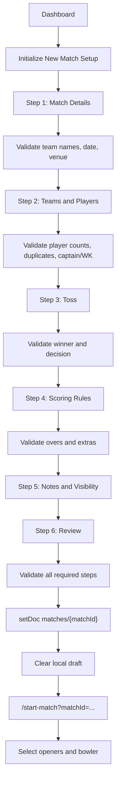

# Match Creation Review

## Scope

This review covers only the existing Match Creation workflow and directly related edit/save/opening setup paths:

- Dashboard entry into match creation
- `MatchCreationPage`
- Match creation step components
- Validation utilities
- Draft persistence
- Match save flow
- Firestore match creation
- Edit Match flow
- Opening setup handoff

No implementation changes were made.

## Current Architecture

### Main Files

| Area | Files |
|---|---|
| Dashboard entry | `src/pages/DashboardPage.jsx`, `src/components/Dashboard/MatchListSection.jsx`, `src/utils/matchDisplay.js` |
| Wizard shell | `src/pages/MatchCreationPage.jsx` |
| Step constants | `src/constants/matchCreation.js` |
| Validation | `src/utils/matchCreationValidation.js` |
| Draft persistence | `src/utils/matchCreationDraft.js`, `src/components/MatchCreation/DraftRecoveryBanner.jsx` |
| Step UI | `MatchDetailsForm.jsx`, `TeamsSetupForm.jsx`, `TossDetailsForm.jsx`, `ScoringRulesForm.jsx`, `NotesForm.jsx`, `PreviewMatch.jsx` |
| Step status/error UI | `WizardStepper.jsx`, `StepErrorAlert.jsx` |
| Save facade | `src/services/firebaseServices.js` |
| Firestore match service | `src/services/firebase/matchService.js` |
| Edit flow | `src/pages/EditMatchPage.jsx` |
| Opening setup | `src/pages/MatchScoring.jsx`, `src/components/match/StartMatch.jsx` |
| Security rules | `firestore.rules` |

### Data Flow

The wizard is local-state first. `MatchCreationPage` owns `formData`, `activeStep`, step errors, submit state, and pending draft state. Each step component receives a slice of `formData` and calls `onUpdate` back into the page.

On submit:

1. `validateAllSteps(formData)` runs.
2. `normalizeTeamsFromDetails` fills team names from match details when missing.
3. `saveMatch(payload, dispatch, navigate)` is called.
4. `saveMatch` calls `createMatch(formData)`.
5. `createMatch` calls `buildMatchFromForm` and writes `matches/{matchId}` with `setDoc`.
6. Redux receives `addMatch(matchData)`.
7. The app navigates to `/start-match?matchId={matchId}`.
8. Opening setup fetches the match and asks for opening batters and bowler.

### Stored Match Shape

`buildMatchFromForm` creates:

```js
{
  matchId,
  matchDetails: {
    teamA,
    teamB,
    location,
    date,
    title,
    matchType
  },
  teams: {
    teamA: { name, players, captain, wicketkeeper },
    teamB: { name, players, captain, wicketkeeper }
  },
  tossDetails: { winner, decision },
  scoringRules: {
    maxOvers,
    extras: { wides, noBalls }
  },
  scoreCard: {},
  notes,
  status: "scheduled",
  createdAt,
  updatedAt,
  isPublic,
  lifecyclePhase: "scheduled",
  archivedAt: null,
  deletedAt: null
}
```

## Workflow Diagram



## Step-by-Step Review

### Dashboard to Create Match

Functionality:

- `DashboardPage` displays create-match CTA only when `isScorer` is true.
- Clicking it navigates to `/create-match`.
- Scheduled match list clicks route scorers to `/start-match?matchId=...`.

Files involved:

- `src/pages/DashboardPage.jsx`
- `src/components/Dashboard/MatchListSection.jsx`
- `src/utils/matchDisplay.js`
- `src/context/AuthContext.jsx`

Validation:

- Access is route-guarded by `ScorerRoute`.
- No additional dashboard-level validation.

Risks:

- If auth role fallback incorrectly grants scorer, match creation becomes available to unintended users.
- Existing scheduled match click goes directly to opening setup, not match details/review. This is fast, but can bypass pre-match review unless the user chooses edit elsewhere.

### Step 1: Match Details

Functionality:

- Captures optional match title.
- Captures Team A, Team B, match type, date/time, and venue.
- Team names are normalized into team setup state by `normalizeTeamsFromDetails`.

Files involved:

- `MatchCreationPage.jsx`
- `MatchDetailsForm.jsx`
- `matchCreationValidation.js`
- `matchCreation.js`

Validation rules:

- Team A required.
- Team B required.
- Team names must be different case-insensitively.
- Date/time required and must parse as valid date.
- Venue required.
- Match type is not explicitly validated beyond UI options.

Edge cases:

- Whitespace-only team names are rejected by validation, but raw untrimmed values are still stored if valid after trimming.
- Date/time can be in the past; there is no future-date or scheduled-date policy.
- Very long team names, venue, or title have no max length.
- Match type can be tampered in state if not from UI.

Data integrity risks:

- Persisted values are not trimmed before Firestore write.
- `dateTime` is stored as a string in `matchDetails.date`, while created/updated timestamps are `Date` objects.

Firestore risks:

- No server-side validation of match field shape or maximum string lengths.

### Step 2: Teams and Players

Functionality:

- Captures players for both teams.
- Allows captain and wicketkeeper selection after enough players are added.
- Removes captain/wicketkeeper if the selected player is removed.
- Blocks duplicate players within the same team at add-time.

Files involved:

- `TeamsSetupForm.jsx`
- `matchCreationValidation.js`
- `matchCreation.js`

Validation rules:

- At least `MIN_PLAYERS_PER_TEAM`, currently 2.
- At most `MAX_PLAYERS_PER_TEAM`, currently 15.
- Duplicate players within each team rejected.
- Captain must be in that team's player list.
- Wicketkeeper must be in that team's player list.

Edge cases:

- Duplicate player names across opposing teams are allowed. That may be valid in rare cases but can confuse scoring and scorecards.
- Add duplicate silently does nothing, with no user feedback.
- Player names are trimmed on add, but no max length exists.
- Names differing by punctuation or internal spacing are considered different.
- Captain and wicketkeeper can be the same person; that is valid in cricket but should be intentional.
- The min player count of 2 is useful for testing but unrealistic for a cricket MVP unless intentionally supporting small-sided formats.

Data integrity risks:

- Players are stored as plain strings, not stable player IDs.
- No team IDs or player IDs exist, so future statistics and tournament reuse will be difficult.
- `TeamsSetupForm` keeps local state and parent state; incorrect sync can create stale form behavior if parent data changes substantially.

Firestore risks:

- No server-side constraints on player count, duplicate players, or string sizes.

### Step 3: Toss

Functionality:

- Selects toss winner from the two team names.
- Selects decision: `Bat` or `Bowl`.
- Opening setup later uses toss winner and decision to determine batting team.

Files involved:

- `TossDetailsForm.jsx`
- `matchCreationValidation.js`
- `StartMatch.jsx`

Validation rules:

- Toss winner required.
- Toss winner must match one of the team names.
- Decision required.

Critical bug:

- `TossDetailsForm.jsx` uses `useState` and `useEffect` but does not import them.
- This can cause a runtime `ReferenceError` when the toss step renders.

Edge cases:

- If team names are changed after toss selection, toss winner may become stale until validation catches it.
- Toss winner comparison is exact and case-sensitive against trimmed team names.
- Decision values are title case (`Bat`, `Bowl`), and opening setup depends on those exact values.

Data integrity risks:

- Toss winner is stored as team name, not `teamA`/`teamB` key. Renaming teams later can make historical toss data inconsistent.

Firestore risks:

- Firestore rules do not enforce valid toss winner or decision values.

### Step 4: Scoring Rules

Functionality:

- Captures overs per side.
- Captures runs awarded for wides and no-balls.
- Converts numeric field input to numbers in local state.

Files involved:

- `ScoringRulesForm.jsx`
- `matchCreationValidation.js`
- `matchCreation.js`
- `StartMatch.jsx`
- scoring components later consume `scoringRules.maxOvers` and `scoringRules.extras`.

Validation rules:

- Overs required.
- Overs must be numeric and between `MIN_OVERS` and `MAX_OVERS`, currently 1 to 50.
- Wide runs must be numeric and at least 0.
- No-ball runs must be numeric and at least 0.

Critical bug:

- `ScoringRulesForm.jsx` uses `useState` and `useEffect` but does not import them.
- This can cause a runtime `ReferenceError` when the scoring rules step renders.

Edge cases:

- Decimal overs such as `2.5` are allowed by validation because only numeric range is checked. In cricket, overs per side should usually be an integer count of overs.
- Extra run values can be decimal because only numeric and non-negative are checked.
- Very large but valid values are capped at 50 overs but extras have no upper bound.
- Zero wide/no-ball penalty is allowed; that may be intentional but should be confirmed.

Data integrity risks:

- `maxOvers` can be decimal, which later scoring logic compares against over counts.
- No server-side validation prevents malformed scoring rules.

Firestore risks:

- The persisted scoring rules are trusted by scoring UI. Bad values can corrupt innings flow.

### Step 5: Notes and Visibility

Functionality:

- Captures optional notes.
- Captures public/private match visibility.
- Visibility defaults to public.

Files involved:

- `NotesForm.jsx`
- `MatchCreationPage.jsx`
- `matchService.js`

Validation rules:

- Notes step is always valid.
- No max length for notes.
- Visibility is coerced to boolean during persistence.

Edge cases:

- Very long notes can increase match document size and degrade dashboard/list rendering.
- Notes may contain arbitrary text; React escapes display by default, but length and formatting are unmanaged.

Data integrity risks:

- Visibility is stored on match document as `isPublic`.
- `isPublic` defaults to true when missing.

Firestore risks:

- Firestore rules allow public reads when `isPublic == true`.
- Signed-in users can read all matches regardless of `isPublic`, which is broader than private-match UX implies.

### Step 6: Review

Functionality:

- Summarizes match, teams, toss, rules, and notes.
- Runs full validation.
- Allows jumping back to edit steps.
- Shows valid/invalid alert.

Files involved:

- `PreviewMatch.jsx`
- `MatchCreationPage.jsx`
- `matchCreationValidation.js`

Validation rules:

- Uses `validateAllSteps`, covering details, teams, toss, and rules.
- Notes and visibility do not block creation.

Edge cases:

- Review displays encoding artifacts such as `—` in fallback values.
- It does not display public/private visibility, so a user can miss the visibility setting before creating.
- It does not display captain/wicketkeeper if not selected beyond team preview chips.

Data integrity risks:

- The final payload is not deeply sanitized; validation checks trimmed forms, but persistence writes original values.

Firestore risks:

- A double click is mitigated by `isSubmitting`, but if state updates lag, duplicate creation risk should still be tested.

### Save Match

Functionality:

- `handleCreateMatch` validates all steps.
- Builds payload and calls `saveMatch`.
- `saveMatch` creates a Firestore match, dispatches Redux add, and navigates to opening setup.
- Draft is cleared after save.

Files involved:

- `MatchCreationPage.jsx`
- `src/services/firebaseServices.js`
- `src/services/firebase/matchService.js`
- `src/store/slices/matchSlice.js`

Validation:

- Client-side only.
- Firestore rules allow create if user role is scorer/admin.

Edge cases:

- Firestore write can succeed but Redux dispatch or navigation could fail.
- Firestore write can fail due permission/network; UI shows generic error.
- `createdAt` is added in `MatchCreationPage` but ignored by `buildMatchFromForm`, which creates its own `Date`.
- `uid()` collision is unlikely but not impossible; `setDoc` would overwrite if collision occurred.

Data integrity risks:

- Uses client `Date` instead of Firestore `serverTimestamp`.
- No `createdBy`, `ownerId`, or scorer assignment is stored.
- No schema version is stored.
- No Firestore transaction or duplicate prevention.

Firestore risks:

- Security rules do not validate the created document structure.
- Missing-profile users can be treated as scorer through auth/rules fallback, so unintended users may create matches.

### Opening Setup Handoff

Functionality:

- After creation, the app navigates to `/start-match?matchId=...`.
- `MatchScoring` subscribes to the match.
- `StartMatch` computes batting team from toss.
- User selects striker, non-striker, and opening bowler.
- Starting writes status `in-progress` and initializes first innings.

Files involved:

- `MatchScoring.jsx`
- `StartMatch.jsx`
- `matchService.js`

Validation:

- Opening setup checks that batting team, two batters, and bowler exist.
- It does not check that the two opening batters are different.

Edge cases:

- Toss data mismatch can prevent batting team calculation.
- If `scoreCard` is missing rather than `{}`, `matchData?.scoreCard.currentInning` can throw because optional chaining stops before `.currentInning`.
- Starting second innings depends on existing first innings shape.

Data integrity risks:

- `inningObj.battingTeam` and `inningObj.bowlingTeam` read `matchData.teams.battingTeam?.name` and `matchData.teams.bowlingTeam?.name`, which do not exist in the persisted shape. These fields will be undefined.
- Opening batters can duplicate.

Firestore risks:

- Starting match writes a broad full match update.
- Rules allow full update while status is scheduled.

## Draft Persistence Verification

### Draft Save

Current behavior:

- `MatchCreationPage` loads draft once on mount.
- If `hasMeaningfulDraft(formData)` is true, it saves a draft after 500 ms on every `formData` or `activeStep` change.
- Draft key: `cricket-scorecard.match-creation-draft`.
- Draft version: `1`.

Files:

- `MatchCreationPage.jsx`
- `matchCreationDraft.js`

Risks:

- Draft is global per browser, not per user.
- If multiple users share a browser, draft data can leak between accounts.
- If multiple tabs are used, tabs can overwrite each other's drafts.
- Save failures are silently ignored.

### Draft Restore

Current behavior:

- On page mount, draft is loaded.
- If meaningful, `DraftRecoveryBanner` appears.
- Restore normalizes team names and restores active step.

Risks:

- `loadMatchCreationDraft` shallow merges `EMPTY_MATCH_FORM` with parsed `formData`, so nested missing fields may not be fully backfilled.
- Restored `activeStep` is not range-checked against current step count.
- Restored invalid data is accepted into state and only later blocked by validation.

### Draft Discard

Current behavior:

- Clears localStorage key.
- Removes banner.
- Shows toast.

Risks:

- Discard does not reset current in-page form data if the user has already restored or entered data.

## Edit Match Flow Verification

Current behavior:

- `/matches/:matchId/edit` loads match through `useLiveMatch`.
- Converts persisted match shape back into the creation form shape.
- If status is `scheduled`, full structural edit is allowed.
- If status is `in-progress` or completed, structural sections are visually disabled and only `isPublic` and `notes` are patched.
- Save validates the same details/team/toss/rules validators.
- Save calls `patchMatchById`.

Files:

- `EditMatchPage.jsx`
- Match creation form components
- `matchCreationValidation.js`
- `matchService.js`
- `firestore.rules`

Bugs and risks:

- `EditMatchPage` renders a top-level visibility switch, then renders `NotesForm` without `isPublic` or `onUpdateVisibility`. This creates a second visibility switch inside `NotesForm` that always defaults to public and is not wired to edit state.
- `NotesForm` in edit flow can mislead users about actual visibility.
- Structural fields are disabled by opacity/pointer events, but users may not understand which fields remain editable.
- `Typography` is imported but unused in `EditMatchPage`, contributing lint noise.
- Completed status handling is not explicit in the UI condition beyond `canEditStructure`.

Firestore/security:

- Rules support scheduled full edits.
- For in-progress/completed matches, rules attempt to block structural changes.
- Because `patchMatchById` only sends patch fields, rules comparing `request.resource.data.teams == resource.data.teams` should evaluate against the post-update full document, but this should be tested in Firebase emulator before trusting.

## Validation Matrix

| Step | Field | Rule | Current Status | Gaps |
|---|---|---|---|---|
| Details | Team A | Required | Present | Not trimmed before save, no max length |
| Details | Team B | Required, different from Team A | Present | Not trimmed before save, no max length |
| Details | Date/time | Required, parseable date | Present | Past dates allowed, stored as string |
| Details | Venue | Required | Present | No max length |
| Details | Match type | UI select | Partial | No validator against allowed values |
| Teams | Players | Min 2, max 15 | Present | Min 2 may not match cricket MVP, no cross-team duplicate policy |
| Teams | Duplicates | Block duplicate within team | Present | Duplicate add silently ignored |
| Teams | Captain | Must be in list | Present | Captain optional |
| Teams | Wicketkeeper | Must be in list | Present | Wicketkeeper optional |
| Toss | Winner | Required and must match team name | Present | Uses team name instead of stable key |
| Toss | Decision | Required | Present | No enum guard beyond UI |
| Rules | Overs | Required, 1-50 numeric | Present | Decimals allowed |
| Rules | Wide runs | Numeric, >= 0 | Present | No upper bound, decimals allowed |
| Rules | No-ball runs | Numeric, >= 0 | Present | No upper bound, decimals allowed |
| Notes | Notes | Always valid | Present | No max length |
| Notes | Visibility | Boolean toggle | Present | Review does not show setting |

## Bugs Found

### P0

1. `TossDetailsForm.jsx` uses `useState` and `useEffect` without imports.

Impact: Toss step can crash at runtime.

2. `ScoringRulesForm.jsx` uses `useState` and `useEffect` without imports.

Impact: Scoring rules step can crash at runtime.

### P1

3. Edit match visibility UI is duplicated and inconsistent.

Evidence: `EditMatchPage` has its own switch, then renders `NotesForm` without `isPublic` and `onUpdateVisibility`; `NotesForm` defaults to public.

Impact: User may think visibility is public even when the real edit state is private.

4. Opening setup does not prevent duplicate opening batters.

Impact: A match can start with the same player as striker and non-striker.

5. `StartMatch` writes undefined `battingTeam` and `bowlingTeam` fields in innings.

Impact: Inning metadata is partially malformed.

6. `scoreCard` access in `StartMatch` is only partially guarded.

Impact: If a legacy match lacks `scoreCard`, opening setup can crash.

### P2

7. Review step does not show public/private visibility.

8. Duplicate player add is silently ignored.

9. Client dates are used instead of server timestamps.

10. Persisted values are not consistently trimmed/sanitized.

11. Match creation has no schema version, owner, or creator metadata.

12. Past match date/time is allowed.

13. Decimal overs and extra values are allowed.

14. Encoding artifacts appear in review/edit copy.

## Edge Cases

- User changes team names after adding players and selecting toss winner.
- User restores an old draft with missing nested fields.
- User opens creation wizard in two tabs.
- User signs in as a different account on same browser and sees prior draft.
- User creates match while offline or with expired permissions.
- Firestore write succeeds but navigation fails.
- Very long notes or player names approach Firestore document size limits.
- Player names collide after trimming/case normalization.
- Team names collide after whitespace normalization but raw values differ.
- Match type is manipulated outside the select values.
- Existing scheduled match is edited while another scorer starts it.
- Edit page receives a legacy match with missing fields.
- Public/private toggle is changed in edit flow while NotesForm displays the opposite state.

## UX Findings

- Wizard flow is clear and guided.
- Draft recovery is a strong UX feature.
- Fixed bottom action bar is useful, but may cover content on small screens.
- The copy uses "Deploying..." for match creation, which feels less cricket/product-specific than "Creating...".
- Step errors do not focus the first invalid field.
- Duplicate player attempts have no visible feedback.
- Review page does not include visibility.
- Edit page disabled sections use opacity/pointer-events; this is understandable visually but weak for accessibility.
- Encoding artifacts reduce polish: `—`, `…`.
- "Playing XI" copy conflicts with `MIN_PLAYERS_PER_TEAM = 2`.

## Security Findings

- Firestore create permission depends on `isScorer`, and current auth fallback can treat missing profiles as scorer.
- Match documents do not store `createdBy`, so ownership cannot be enforced later.
- Signed-in users can read all private matches under current rules.
- Firestore rules do not validate match document shape on create.
- Client-side validation can be bypassed by direct Firestore writes from any scorer/admin.
- Drafts in localStorage are not user-scoped and can leak setup data on shared devices.

## Data Integrity Findings

- Teams and players are embedded strings, not stable entities.
- Toss winner is stored by team name, not team key.
- Date fields use mixed types: match date string, created/updated JS `Date`.
- No schema version exists.
- No creator/scorer metadata exists.
- No transactional duplicate protection exists.
- `setDoc` with generated id will overwrite on improbable id collision.
- Decimal overs can destabilize innings limit logic.
- Undefined innings metadata is created in `StartMatch`.
- Visibility defaults to public in multiple places.

## Firestore Risks

- No server-side validation for required fields, string limits, player counts, enum values, or scoring rule ranges.
- Rules allow scheduled full updates from scorers/admins.
- Private matches are not private from signed-in users.
- Client `Date` depends on user clock.
- Rules and UI both assume status lifecycle values are correct, but create/update does not server-validate lifecycle transitions.

## Recommended Fixes

### Stabilization Fixes Only

1. Import missing React hooks in `TossDetailsForm.jsx`.
2. Import missing React hooks in `ScoringRulesForm.jsx`.
3. Fix edit visibility UI by either wiring `NotesForm` visibility props or suppressing its visibility switch in edit mode.
4. Prevent duplicate opening batters in `StartMatch`.
5. Fix `StartMatch` inning metadata to use the actual batting/bowling team keys or names.
6. Guard legacy/malformed `scoreCard` access in opening setup.
7. Display public/private visibility on review.
8. Add local feedback when duplicate players are ignored.
9. Trim/sanitize persisted strings before `buildMatchFromForm`.
10. Use integer validation for overs and extra run values if cricket rules require integers.

### Security/Data Follow-Ups

11. Add `createdBy`, `createdByEmail`, or scorer ownership metadata to new matches.
12. Use `serverTimestamp()` for created/updated fields.
13. Add schema version to match documents.
14. Tighten Firestore create/update validation after finalizing schema.
15. Scope drafts by user id after auth stabilization.

## Priority Ranking

### P0 - Blocks Match Creation Stabilization

1. Missing hook imports in `TossDetailsForm`.
2. Missing hook imports in `ScoringRulesForm`.

### P1 - High Impact Before MVP

3. Duplicate/conflicting visibility UI in edit flow.
4. Duplicate opening batters allowed.
5. Undefined innings metadata in `StartMatch`.
6. Missing creator/ownership metadata.
7. Private match rules are broader than UX implies.

### P2 - Important Stabilization Polish

8. Review page omits visibility.
9. Duplicate player add has no feedback.
10. Persisted strings are not trimmed.
11. Client timestamps instead of server timestamps.
12. Decimal overs/extras accepted.

### P3 - Later Product Hardening

13. First-class team/player IDs.
14. Drafts scoped by user.
15. Schema versioning and migration utilities.
16. Better edit-mode locked-section explanations.

## Approval Gate

Before implementation, confirm these product rules:

1. Should overs per side be integers only?
2. Should extra run penalties be integers only, and should there be an upper bound?
3. Should minimum players remain 2 for MVP testing, or move closer to real cricket formats?
4. Should duplicate player names across opposing teams be allowed?
5. Should public/private visibility be shown and confirmed on the review step?
6. Should every new match store `createdBy` now, before further MVP workflows depend on ownership?

