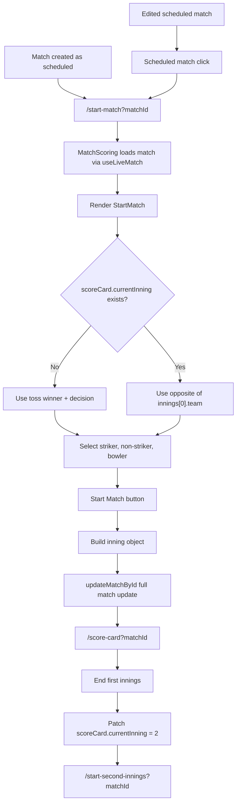

# Opening Setup Review

## Scope

This review covers only the Opening Setup workflow:

- `MatchScoring.jsx`
- `StartMatch.jsx`
- Handoff from match creation/edit/dashboard
- Toss resolution logic
- Batting/bowling team calculation
- Striker and non-striker selection
- Opening bowler selection
- First innings initialization
- Second innings setup handoff
- Firestore updates related to starting innings

No implementation changes were made.

## Architecture Overview

### Main Files

| Area | Files |
|---|---|
| Created-match handoff | `src/services/firebaseServices.js`, `src/pages/MatchCreationPage.jsx` |
| Scheduled-match routing | `src/utils/matchDisplay.js`, dashboard match list components |
| Opening setup route | `src/pages/MatchScoring.jsx` |
| Opening setup UI and innings object creation | `src/components/match/StartMatch.jsx` |
| First innings end and second innings handoff | `src/components/match/ScoreCard.jsx`, `src/components/match/EndOfInnings.jsx` |
| Firestore updates | `src/services/firebase/matchService.js`, `src/services/firebase/scoringService.js` |
| Security rules | `firestore.rules` |

### Route Shape

Opening setup is query-param based:

- First innings setup: `/start-match?matchId={matchId}`
- Second innings setup: `/start-second-innings?matchId={matchId}`

Both routes render `MatchScoring`, which reads `matchId` from `useSearchParams` and renders `StartMatch` after loading the match.

### State Ownership

| State | Owner | Notes |
|---|---|---|
| `matchId` | URL query string | Required for loading match |
| `matchData` | `useLiveMatch` in `MatchScoring` | Realtime document subscription |
| `battingTeam` | `StartMatch` local state | Computed once from `getBattingTeam()` |
| `bowlingTeam` | Derived variable in `StartMatch` | Opposite of `battingTeam` |
| `players.batsman1` | `StartMatch` local state | Striker |
| `players.batsman2` | `StartMatch` local state | Non-striker |
| `bowler` | `StartMatch` local state | Opening bowler |
| `scoreCard` | Firestore match doc | Initialized/extended by `StartMatch` |

## Workflow Diagram



## Current Workflow Trace

### Match Created to Opening Setup

Current behavior:

1. `MatchCreationPage` calls `saveMatch`.
2. `saveMatch` creates the Firestore match.
3. It dispatches `addMatch`.
4. It navigates to `/start-match?matchId={matchId}`.
5. `MatchScoring` reads the query param.
6. `useLiveMatch(matchId)` subscribes to the match document.
7. `StartMatch` renders once `matchData` exists.

Files:

- `src/pages/MatchCreationPage.jsx`
- `src/services/firebaseServices.js`
- `src/pages/MatchScoring.jsx`
- `src/components/match/StartMatch.jsx`

Risks:

- The URL depends on a query parameter; auth redirects that only preserve `pathname` can lose `matchId`.
- If `matchId` is missing, an error is shown.
- If the match exists but is not scheduled, this setup route still renders `StartMatch`.

### Scheduled Match from Dashboard to Opening Setup

Current behavior:

- `getMatchRoute(match, { isScorer })` sends scorer users to `/start-match?matchId=...` when `match.status === "scheduled"`.

Files:

- `src/utils/matchDisplay.js`
- `src/components/Dashboard/MatchListSection.jsx`

Risks:

- Scheduled matches go directly to opening setup rather than a details/review page.
- If a scheduled match already has partial `scoreCard` data from a failed start, the route still enters setup.

### Toss Resolution Logic

Current first innings logic:

- If `matchData.scoreCard.currentInning` exists, `StartMatch` assumes this is a later innings and uses the opposite of first innings team.
- Otherwise:
  - If toss winner equals `teams.teamA.name` and decision is `Bat`, batting team is `teamA`.
  - If toss winner equals `teams.teamA.name` and decision is not `Bat`, batting team is `teamB`.
  - If toss winner equals `teams.teamB.name` and decision is `Bat`, batting team is `teamB`.
  - If toss winner equals `teams.teamB.name` and decision is not `Bat`, batting team is `teamA`.

Files:

- `StartMatch.jsx`

Risks:

- Toss winner is compared by team name, not stable team key.
- Decision logic treats any non-`Bat` value as bowl.
- If team names change after toss or if legacy data has different casing, batting team may be `undefined`.
- `matchData?.scoreCard.currentInning` is unsafe if `scoreCard` is missing because optional chaining stops before `.currentInning`.

### Select Striker and Non-Striker

Current behavior:

- Both dropdowns list all players from the batting team.
- `batsman1` becomes striker with `isNonStriker: false`.
- `batsman2` becomes non-striker with `isNonStriker: true`.

Files:

- `StartMatch.jsx`

Validation:

- Requires both fields to be truthy.

Missing validation:

- No prevention for selecting the same player as both striker and non-striker.
- No validation that selected players still exist in the current batting team at submit time.

### Select Opening Bowler

Current behavior:

- Bowler dropdown lists all players from the bowling team.
- Selected bowler becomes the only bowler in the new innings.
- Bowler is marked `currentBowler: true`.

Files:

- `StartMatch.jsx`

Validation:

- Requires `bowler` to be truthy.

Missing validation:

- No validation that selected bowler still exists in current bowling team at submit time.
- No role/type distinction for wicketkeeper or player availability.

### Start First Innings

Current behavior:

1. `handleStart` validates `battingTeam`, both batters, and bowler are selected.
2. It creates `inningObj`.
3. If `matchData.scoreCard.currentInning` is falsy:
   - Sets match status to `in-progress`.
   - Sets `scoreCard.currentInning = 1`.
   - Sets `scoreCard.innings = [inningObj]`.
   - Sets `scoreCard.currentBowler`.
4. Calls `onStart(updatedMatchData)`.
5. `MatchScoring.startMatch` calls `updateMatchById(updatedMatchData)`.
6. On success, navigates to `/score-card?matchId=...`.

Files:

- `StartMatch.jsx`
- `MatchScoring.jsx`
- `matchService.js`

Data mutation:

```js
{
  ...matchData,
  status: "in-progress",
  scoreCard: {
    currentInning: 1,
    innings: [inningObj],
    currentBowler: { name: bowler, overs: 0, runs: 0, wickets: 0 }
  },
  updatedAt: new Date()
}
```

Risks:

- Full document update is used.
- No transaction ensures match is still scheduled.
- Duplicate click protection is absent in `StartMatch`; repeated clicks can send repeated updates.
- `inningObj.battingTeam` and `inningObj.bowlingTeam` are read from non-existent `matchData.teams.battingTeam` and `matchData.teams.bowlingTeam`, so they become `undefined`.

### Start Second Innings Setup

Current behavior:

1. First innings ends in `ScoreCard`.
2. `EndOfInnings` shows summary and scorecard.
3. Clicking `Start 2nd Innings` calls `persistCurrentInning(matchId, 2)`.
4. This patches Firestore field `"scoreCard.currentInning": 2`.
5. App navigates to `/start-second-innings?matchId={matchId}`.
6. `MatchScoring` loads the match.
7. `StartMatch` sees `scoreCard.currentInning` exists and chooses the opposite team from `scoreCard.innings[0].team`.
8. On submit, it appends the second `inningObj` to `scoreCard.innings`.

Files:

- `ScoreCard.jsx`
- `EndOfInnings.jsx`
- `scoringService.js`
- `matchService.js`
- `MatchScoring.jsx`
- `StartMatch.jsx`

Risks:

- The system sets `scoreCard.currentInning = 2` before the second innings object exists.
- During the gap between patch and appending innings, routes/components that expect `innings[currentInning - 1]` may see `undefined`.
- `EndOfInnings` always says `End of 1st Innings`; it is not safe for second innings completion.
- `StartMatch` appends innings if any `currentInning` exists, so malformed first-innings state can lead to incorrect second innings creation.

## Validation Matrix

| Area | Current Rule | Status | Gap |
|---|---|---|---|
| Match ID | Must exist in query param | Present | Query can be lost on auth redirect |
| Match loaded | `useLiveMatch` loads by id | Present | No status/shape guard before `StartMatch` |
| Setup allowed | Route is scorer/admin guarded | Present | No local status guard for scheduled vs in-progress/completed |
| Batting team | Derived from toss or first innings | Partial | Uses team name comparison and unsafe `scoreCard` access |
| Bowling team | Opposite of batting team | Present | If batting team undefined, defaults to `teamA` as bowling team |
| Striker | Required | Present | Duplicate with non-striker allowed |
| Non-striker | Required | Present | Duplicate with striker allowed |
| Opening bowler | Required | Present | No revalidation against team roster at submit |
| First innings | Creates scorecard with currentInning 1 | Present | Writes undefined team metadata |
| Second innings | Appends second innings after currentInning patch | Partial | Intermediate invalid state possible |
| Legacy match | Some optional reads | Weak | Missing `scoreCard` can crash |

## Bugs Found

### P0

1. Unsafe `scoreCard` optional chaining in `StartMatch`.

Evidence:

- `matchData?.scoreCard.currentInning` checks `matchData`, but not `scoreCard`.
- Later code also uses `matchData.scoreCard.currentInning`.

Impact:

- Legacy or malformed matches without `scoreCard` can crash opening setup.

2. Second innings transition creates an intermediate invalid scorecard state.

Evidence:

- `EndOfInnings` patches `scoreCard.currentInning = 2` before a second innings object exists.
- Other scoring code reads `scoreCard.innings[scoreCard.currentInning - 1]`.

Impact:

- A refresh or route into `/score-card` after the patch but before second innings setup completion can encounter missing current innings data.

### P1

3. Duplicate opening batters are allowed.

Impact:

- The same player can be both striker and non-striker, corrupting innings state immediately.

4. Inning metadata fields are written as undefined.

Evidence:

- `inningObj.battingTeam = matchData.teams.battingTeam?.name`
- `inningObj.bowlingTeam = matchData.teams.bowlingTeam?.name`
- Persisted teams are keyed as `teamA` and `teamB`, not `battingTeam` and `bowlingTeam`.

Impact:

- Inning object contains unreliable metadata.

5. Start setup does not validate match status.

Impact:

- Scorer can potentially revisit opening setup for an in-progress/completed match and append or overwrite innings unexpectedly.

6. Start button lacks pending/disabled state.

Impact:

- Double-clicks can trigger duplicate writes or repeated navigation attempts.

### P2

7. Toss decision logic treats any non-`Bat` value as bowl.

8. Toss winner is stored and compared by team name, not team key.

9. `EndOfInnings` text is hardcoded to `End of 1st Innings`.

10. Query-param route style is brittle for auth redirects and sharing internal scorer links.

11. Terminology uses `Batsman` instead of `Batter`.

12. Opening setup does not explain why a team is batting first.

## Edge Cases

- Missing `matchId` query param.
- Invalid `matchId`.
- Match exists but `scoreCard` is missing.
- Match exists with `scoreCard.currentInning` but no `scoreCard.innings`.
- Match has `currentInning = 2` but only one innings object.
- Toss winner does not match either current team name.
- Toss decision is lowercase, empty, or legacy value.
- Team names changed after toss.
- Team players array empty or missing.
- Same opening batter selected twice.
- Bowler selected, then match roster changed by another tab before start.
- User double-clicks Start Match.
- First scorer starts match while another scorer is editing.
- User navigates directly to `/start-second-innings` before first innings is complete.
- User refreshes after `currentInning` patch but before second innings object append.

## Data Mutations

### First Innings Object

Current shape:

```js
{
  team: battingTeam,
  battingTeam: undefined,
  bowlingTeam: undefined,
  runs: 0,
  wickets: 0,
  overs: 0,
  balls: 0,
  batsmen: [
    { name, runs: 0, balls: 0, isOut: false, isNonStriker: false, fours: 0, sixes: 0 },
    { name, runs: 0, balls: 0, isOut: false, isNonStriker: true, fours: 0, sixes: 0 }
  ],
  bowlers: [
    { name, overs: 0, runs: 0, wickets: 0, balls: 0, currentBowler: true }
  ],
  extras: [
    { wides: 0, noBalls: 0, byes: 0, legByes: 0, total: 0 }
  ]
}
```

### Firestore Write: Start First Innings

`MatchScoring.startMatch` calls:

```js
updateMatchById(nextMatchData)
```

This performs a broad `updateDoc` with the full match payload.

### Firestore Write: Start Second Innings Setup

`EndOfInnings.startSecondInnings` calls:

```js
persistCurrentInning(matchId, 2)
```

This patches:

```js
{
  "scoreCard.currentInning": 2,
  updatedAt: new Date()
}
```

Then `StartMatch` appends the second innings object with a later full update.

## Data Integrity Risks

- Opening batter duplication corrupts scoring state from ball one.
- Undefined `battingTeam` and `bowlingTeam` fields produce inconsistent innings documents.
- Second innings setup creates a temporary scorecard state where `currentInning` points to a non-existent innings object.
- Full document updates can overwrite concurrent changes.
- No `startedAt`, `startedBy`, or innings setup audit metadata is stored.
- Toss selection depends on mutable team names.
- `currentBowler` is duplicated both inside innings bowlers and at `scoreCard.currentBowler`.
- There is no schema version or migration guard for legacy matches.

## Firestore Risks

- Start first innings uses full document update instead of a targeted patch or transaction.
- Firestore rules allow full updates while status is `scheduled`; if two scorers start at once, last write wins.
- Starting second innings uses a partial patch that can temporarily violate scorecard invariants.
- Firestore rules do not validate innings object shape.
- Client timestamps are used for `updatedAt`.
- Missing ownership model allows any scorer/admin to start any match.

## UX Findings

- The setup screen is simple and focused.
- It shows useful chips for teams, venue, toss, and decision.
- It does not show an explicit sentence like "Team X bats first because Team Y chose to bowl."
- Duplicate batter selection is not prevented in the UI.
- There is no loading state on Start Match after click.
- Error feedback is generic.
- If toss resolution fails, the form simply does not render selection fields but does not explain why.
- "Batsman" terminology is less modern than "Batter."
- Second innings setup reuses "Start Match", which may be confusing; "Start 2nd Innings" would better describe the action.

## Security Issues

- Route is protected by `ScorerRoute`, but authorization is role-only, not match-specific.
- Any scorer/admin can start any match.
- Missing-profile scorer fallback from auth/rules can indirectly expose this workflow to unintended users.
- Firestore rules do not enforce valid state transitions such as scheduled to in-progress only once.

## Legacy Match Compatibility

Current compatibility:

- Works for newly created matches where `scoreCard` is `{}`.
- Can infer second batting team from `scoreCard.innings[0].team`.

Weaknesses:

- Missing `scoreCard` can crash.
- `scoreCard.currentInning` without innings can crash or misroute.
- Legacy toss decisions with lowercase values are not normalized.
- Legacy team shapes without `teams.teamA.players` can crash dropdown rendering.

## Recommended Fixes

### Stabilization Fixes Only

1. Guard all `scoreCard` reads in `StartMatch` with safe optional chaining and fallback behavior.
2. Add validation that striker and non-striker must be different.
3. Correct innings metadata to derive batting and bowling team names from `teams[battingTeam]` and `teams[bowlingTeam]`.
4. Add status/shape guard before rendering `StartMatch`; only allow first setup for scheduled matches and second setup for valid post-first-innings state.
5. Add submit loading state and disable Start Match while write is pending.
6. Normalize toss decision handling to explicit `Bat`/`Bowl` only.
7. Make second innings setup atomic: create/append the second innings object and set `currentInning = 2` in the same write.
8. Preserve query string in auth redirects so `/start-match?matchId=...` survives login.
9. Add user-facing error when batting team cannot be resolved.
10. Add basic legacy guards for missing teams/players arrays.

### Later Hardening

11. Store toss winner as team key plus display name.
12. Add `startedAt`, `startedBy`, and `inningsStartedAt` metadata.
13. Use Firestore transaction or conditional update for start match.
14. Add ownership/assigned scorer checks.
15. Move route style toward `/matches/:matchId/start` for better stability.

## Priority Ranking

### P0 - Blocks Opening Setup Stabilization

1. Unsafe `scoreCard` access in `StartMatch`.
2. Intermediate invalid second innings state.
3. Duplicate striker/non-striker allowed.

### P1 - High Impact Before MVP

4. Undefined innings metadata fields.
5. Missing match status guard before setup.
6. No duplicate-submit protection.
7. Full-document start update can overwrite concurrent changes.

### P2 - Important Stabilization Polish

8. Toss decision should be explicit, not "anything other than Bat means Bowl."
9. Query-string route can lose matchId after auth redirect.
10. Missing user-facing error when toss/team resolution fails.
11. Hardcoded first-innings text in second-innings-adjacent component.

### P3 - Later Product Hardening

12. Team-key-based toss model.
13. Start metadata/audit fields.
14. Assigned scorer or match ownership enforcement.
15. Better terminology and explanatory copy.

## Approval Gate

Before implementation, confirm:

1. Should second innings setup create the second innings object before navigating, or should setup page create it atomically on submit?
2. Should a scheduled match with existing scorecard data be repaired, blocked, or allowed to resume setup?
3. Should any scorer be allowed to start any match for MVP, or should created/assigned scorer ownership be enforced now?
4. Should route style remain query-based for stabilization, or should route cleanup wait until later?

