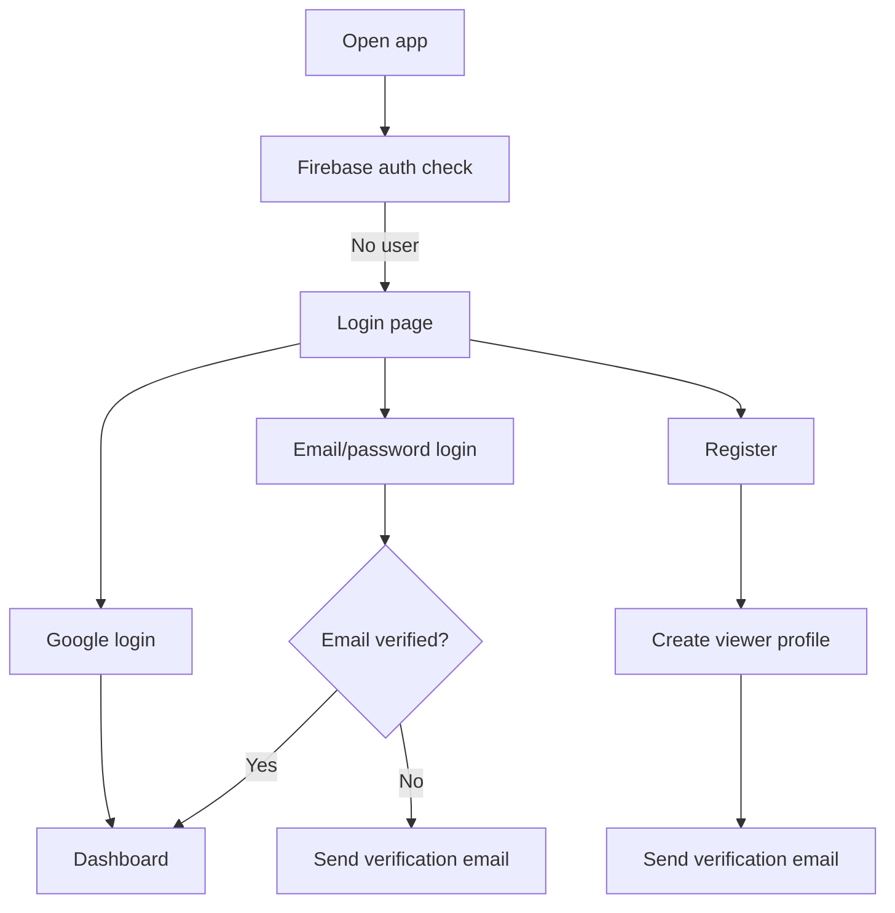
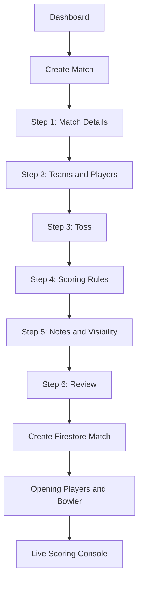
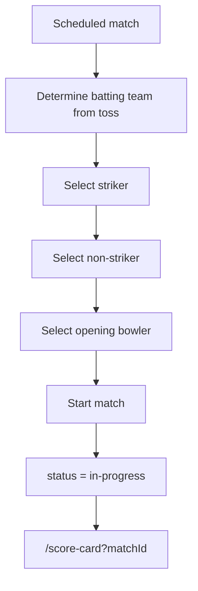
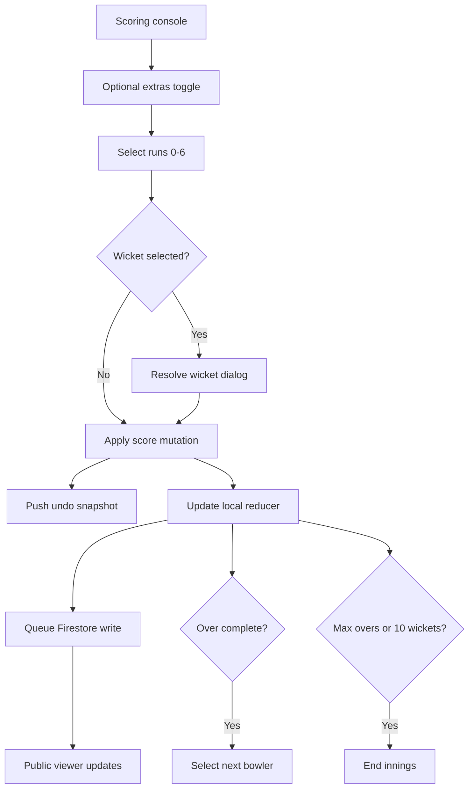
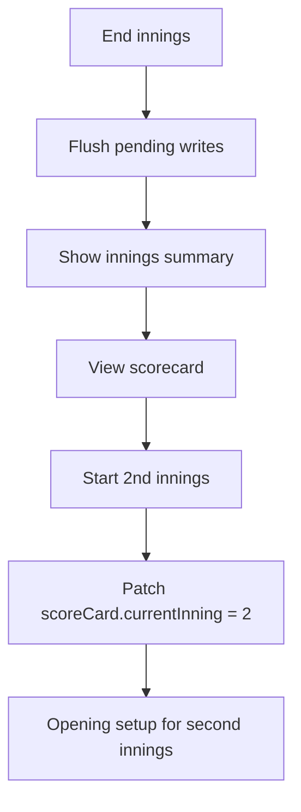
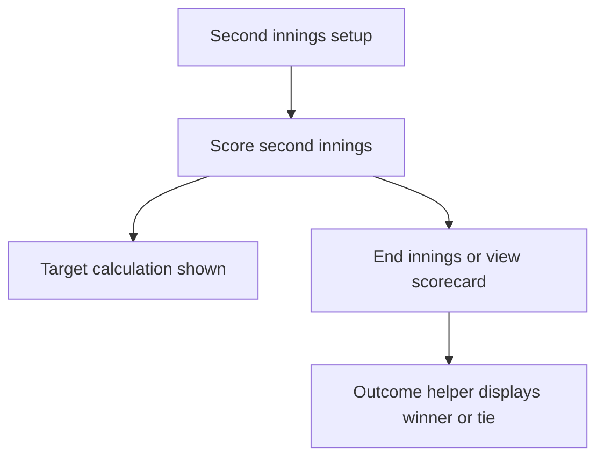
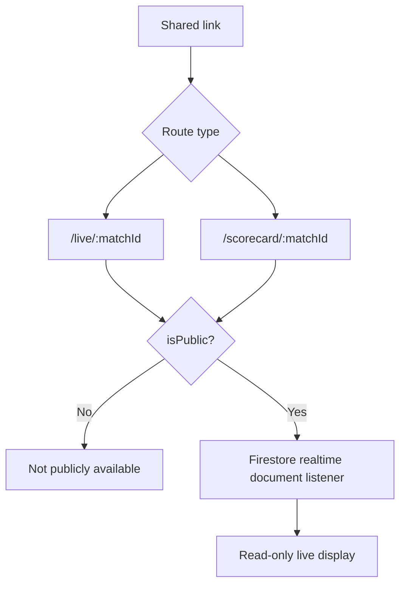
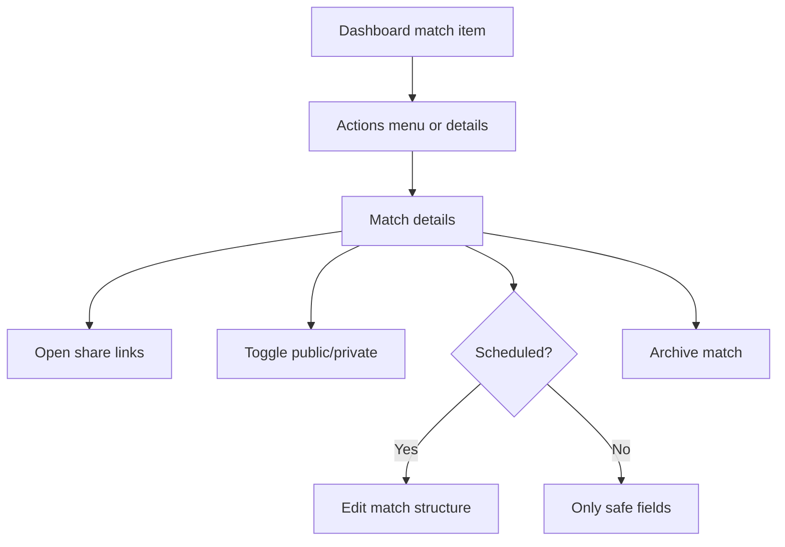
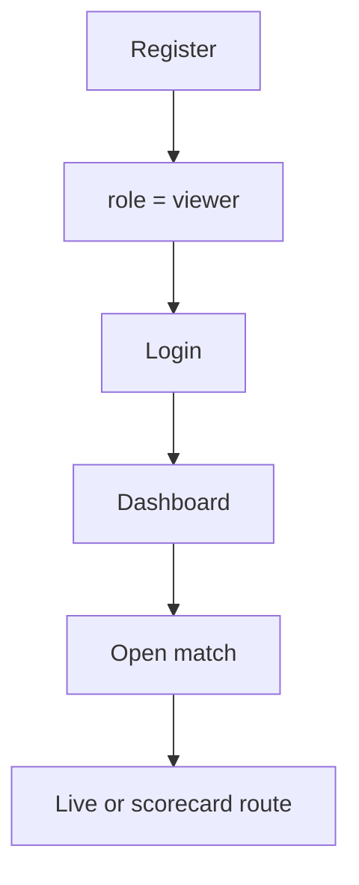

# CricVelo User Flow Document

## Primary Roles

- Scorer: creates matches and performs live scoring.
- Viewer: signs in and follows matches.
- Public spectator: opens shared live or scorecard links without signing in.
- Admin: defined as a role but has no separate UI yet.

## Authentication Flow

Issues:

- Forgot password link points to registration, not a password reset.
- Google sign-in creates scorer profiles by default through legacy profile behavior.

## Scorer Match Creation Flow

Draft behavior:

- Meaningful wizard input is autosaved to localStorage.
- Returning users can restore or discard the draft.

## Opening Setup Flow

Issues:

- Same player can potentially be selected for both batting slots.
- Opening setup does not appear to validate unavailable bowlers beyond team selection.

## Ball-by-Ball Scoring Flow

## End of First Innings Flow

Issue:

- The first innings flow exists, but final match completion after second innings is not robustly represented.

## Second Innings and Result Flow

Current intended path:

Observed gap:

- The code can display a final scorecard outcome helper, but no reliable status transition to `completed` was found in the active scoring path.

## Public Spectator Flow

## Match Management Flow

## Viewer Authenticated Flow

Viewer restrictions:

- Cannot create matches.
- Cannot score.
- Cannot edit.

## Missing Flows

- Tournament creation to fixtures to points table
- Team manager squad administration
- Player profile and statistics
- Auction setup to bidding to sold players
- Admin user role promotion
- Password reset
- Match restore/delete
- Export scorecard

